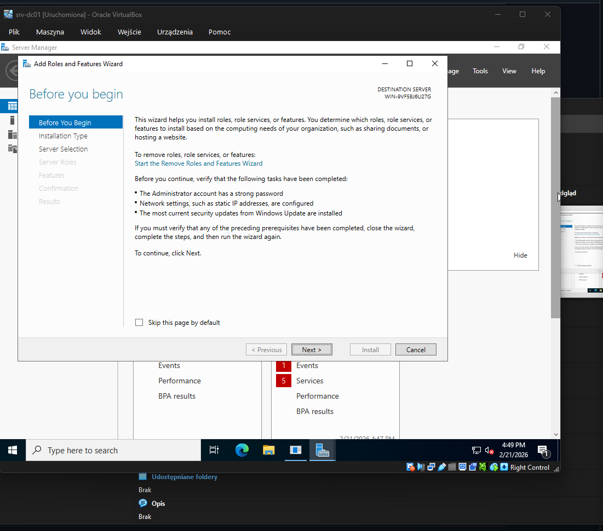
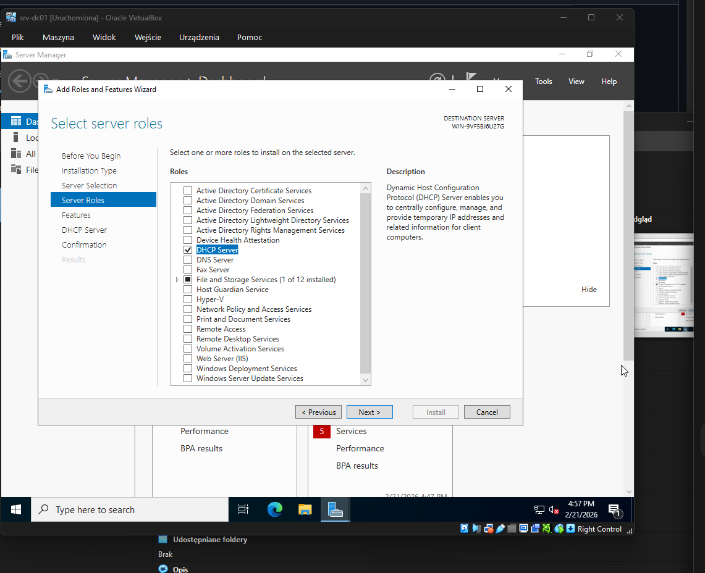
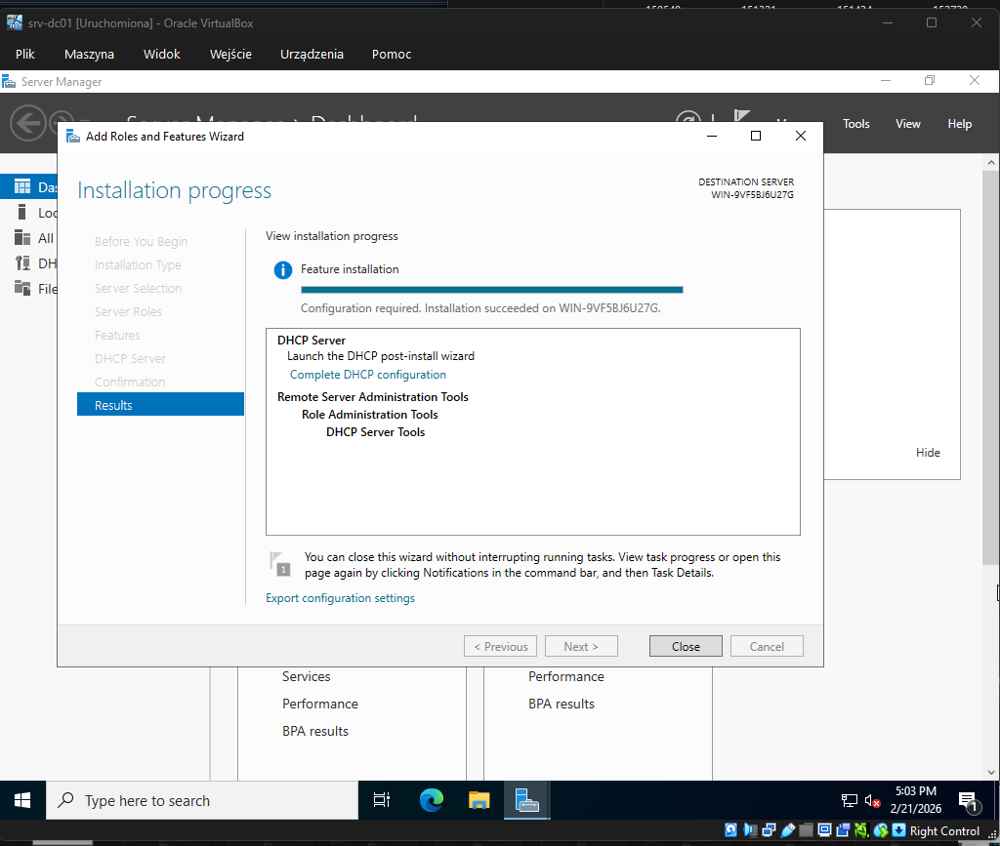
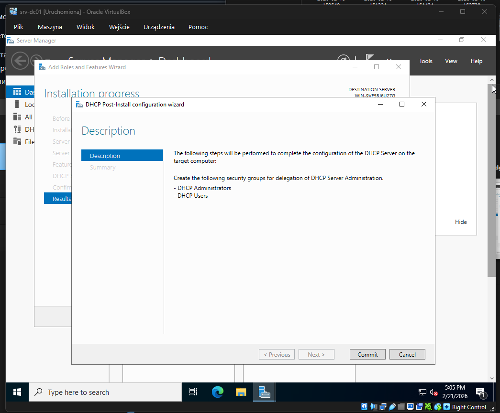
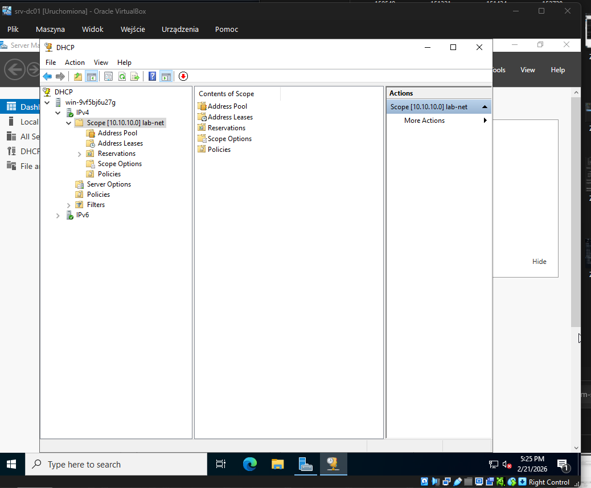
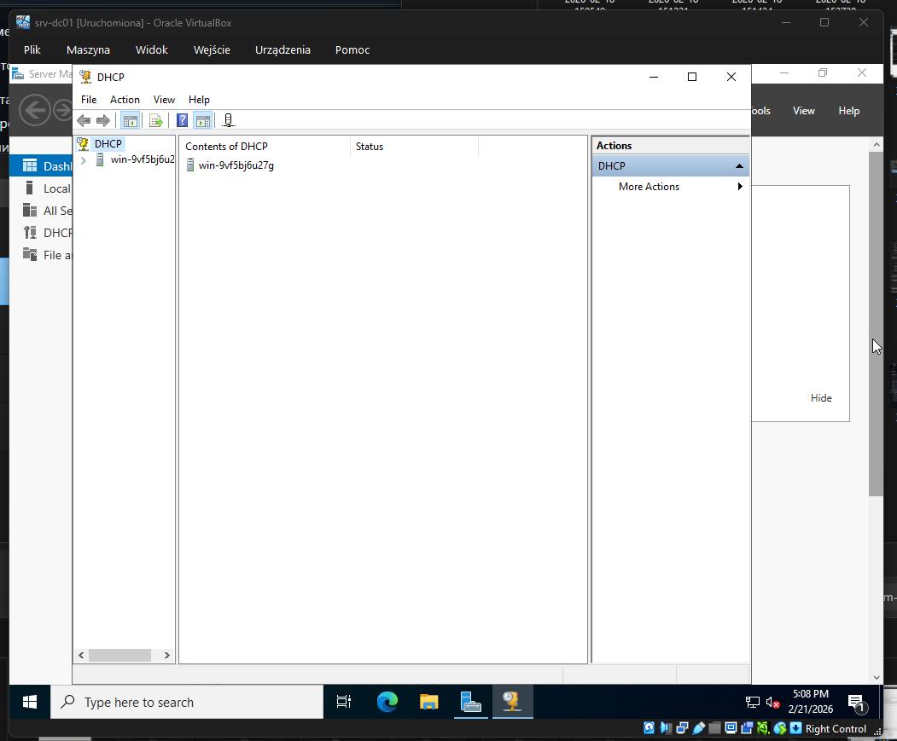

# DHCP Setup (srv-dc01)

## Цель

Настроить DHCP-сервер на srv-dc01 для автоматической выдачи IP-адресов клиентам внутренней сети lab-net.

---

## Контекст лаборатории

Hypervisor: VirtualBox  
Network: lab-net (Internal Network)  
DHCP Server: srv-dc01  
OS: Windows Server 2022  

Network: 10.10.10.0/24  

---

## Установка роли DHCP

### Запуск мастера установки

---

### Выбор роли DHCP Server

---

### Установка завершена

---

## Post-install configuration

---

## Создание Scope

Scope Name: lab-net  
Network: 10.10.10.0/24  
Range: 10.10.10.100 – 10.10.10.200  
Exclusions: 10.10.10.10  
DNS: 10.10.10.10  
Domain: lab.local  

---

### Scope активен

---

## Проверка DHCP Manager

---

## Проверка клиентов

Windows:

ipconfig /release  
ipconfig /renew  
ipconfig /all  

Linux:

ip a  
ip route  

---

## Результат

DHCP Server установлен и работает.

srv-dc01 выдает IP адреса клиентам lab-net.

## Полные артефакты установки и настройки DHCP

Все скриншоты всех этапов установки, конфигурации и создания Scope находятся в каталоге:

📁 [images/lab-virtualization/dhcp/](../../images/lab-virtualization/dhcp/)

В каталоге содержатся:

- установка роли DHCP
- DHCP Post-Install Configuration
- создание Scope
- настройка DNS и параметров Scope
- активация Scope
- DHCP Manager и итоговая конфигурация

Это полный журнал установки и настройки DHCP-сервера в лабораторной среде.