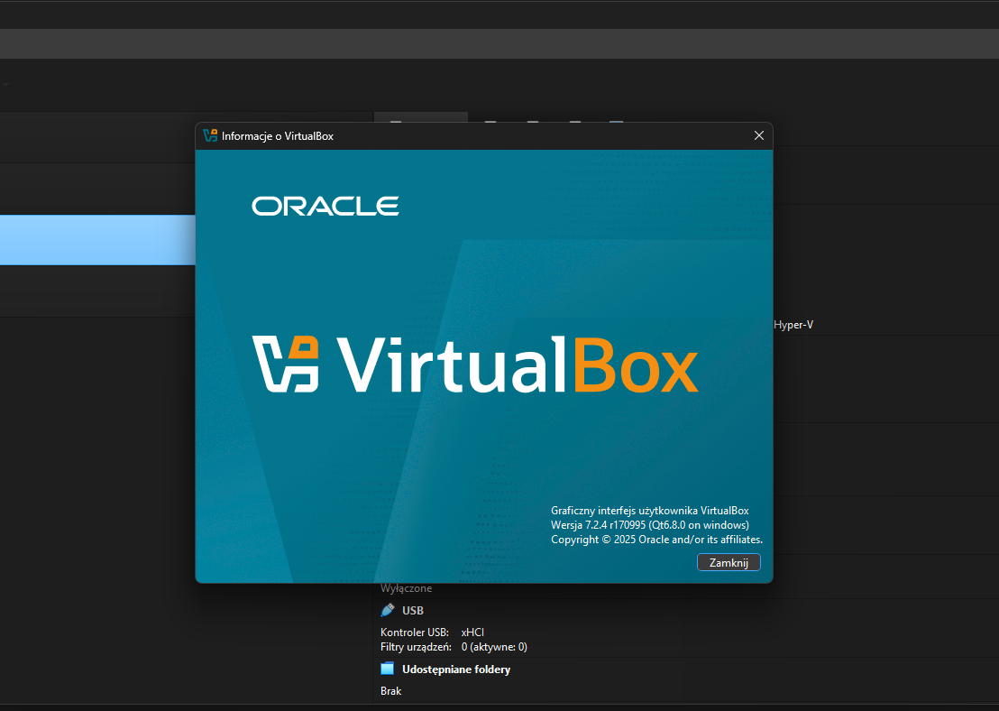
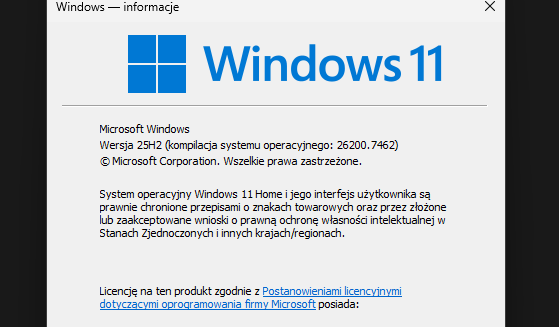
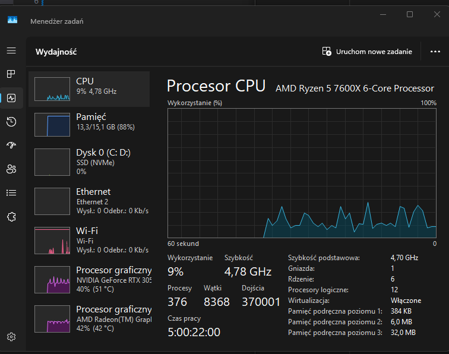
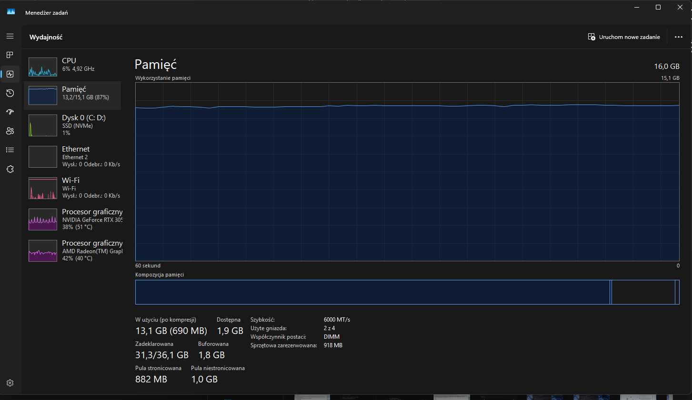
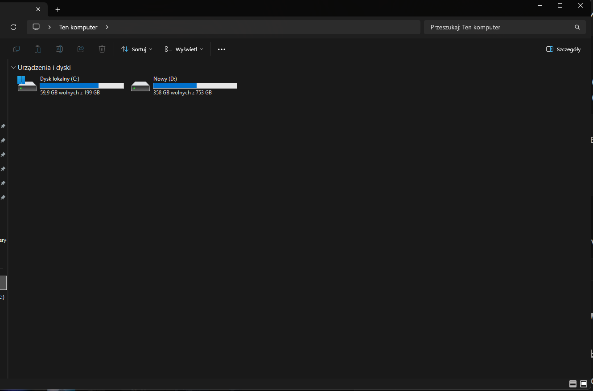

# Host Specs (хост-машина)

> Цель: зафиксировать характеристики хоста, на котором выполняются виртуальные машины лаборатории.

---

## Общая информация

- Дата фиксации: 2026-02-20  
- ОС хоста: Windows 11 Home 25H2 (Build 26200.7462)  
- Гипервизор: Oracle VM VirtualBox 7.2.4 r170995 (Qt6.8.0)  

Скриншот:  

---

## CPU

- Модель: AMD Ryzen 5 7600X 6-Core Processor  
- Ядер: 6  
- Логических процессоров: 12  
- Базовая частота: 4.70 GHz  
- Virtualization: Enabled  

Скриншот:  

---

## RAM

- Общий объём: 16 GB  
- Тип: DDR5  
- Скорость: 6000 MT/s  
- Используемые слоты: 2/4  

Скриншот:  

---

## Storage

| Disk | Filesystem | Total | Free | Purpose |
|------|------------|-------|------|---------|
| C:   | NTFS | 199 GB | 59.9 GB | Host OS and applications |
| D:   | NTFS | 753 GB | 358 GB | Virtual machines, lab files, artifacts |

Скриншот:  

---

## Virtualization readiness

Хост-машина поддерживает аппаратную виртуализацию (AMD-V), которая включена и используется VirtualBox.

Это позволяет запускать:

- Ubuntu Server
- Windows Server
- Windows Client
- Kali Linux

в изолированной лабораторной среде.

---

## Lab usage role

Этот хост используется как основная платформа для:

- запуска VirtualBox VM  
- системного администрирования лабораторий  
- pentest лабораторий  
- тестирования сетевых конфигураций  
- построения Active Directory среды  

---

## Artifacts location

Все скриншоты находятся в:

[`images/lab-virtualization/hypervisor/`](../../images/lab-virtualization/hypervisor/)