# План сети (Network Plan)

## Цель

Этот документ описывает сетевую архитектуру лабораторной среды VirtualBox.

Цели:

- изолировать лабораторную сеть
- обеспечить интернет-доступ для обновлений
- создать воспроизводимую инфраструктуру
- зафиксировать конфигурацию сети как артефакт

---

## Сегменты сети

В лаборатории используются два сетевых сегмента:

### 1. NAT (доступ в интернет)

Назначение:

- обновление системы
- установка пакетов
- доступ к внешним ресурсам
- загрузка инструментов

Характеристики:

- предоставляется VirtualBox автоматически
- типичная сеть: `10.0.2.0/24`
- шлюз: `10.0.2.2`
- IP назначается через DHCP VirtualBox

---

### 2. Internal Network: `lab-net` (внутренняя лабораторная сеть)

Назначение:

- связь между виртуальными машинами
- Active Directory лаборатория
- тестирование атак
- изолированная среда

Характеристики:

- полностью изолирована от внешней сети
- доступ только между VM внутри `lab-net`
- интернет отсутствует

---

## Конфигурация виртуальных машин

Все виртуальные машины используют:

- Adapter 1: Internal Network (`lab-net`)
- Adapter 2: NAT

---

## Артефакты: настройки сети VirtualBox

### Kali Linux

Internal Network:

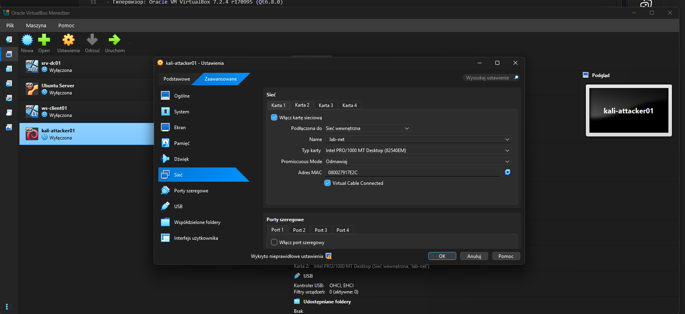

NAT:

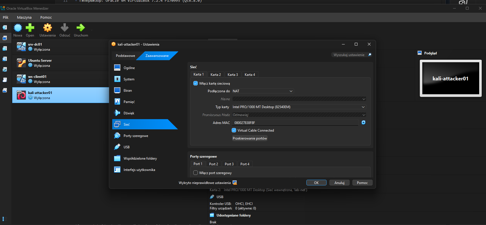

---

### Windows Server (srv-dc01)

Internal Network:

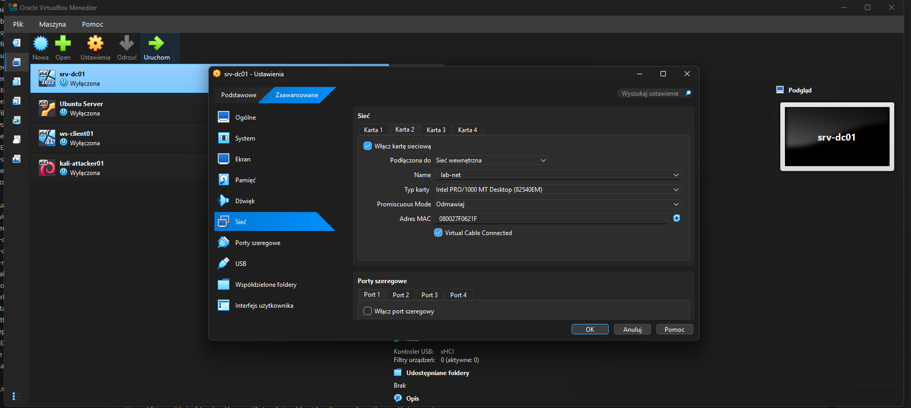

NAT:

---

### Ubuntu Server

Internal Network:

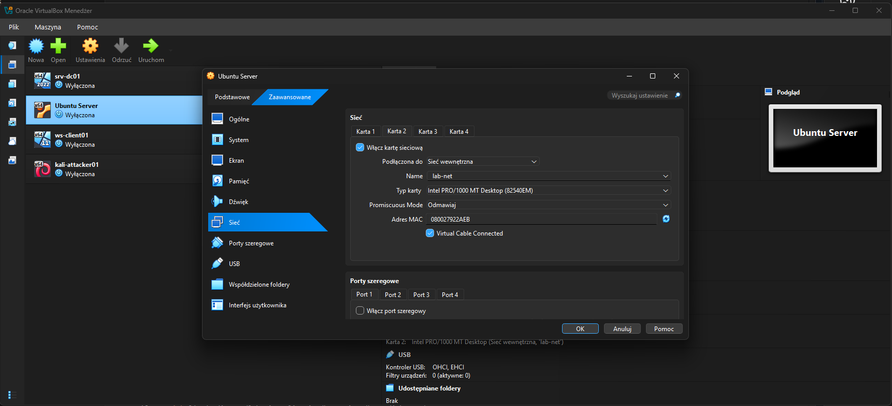

NAT:

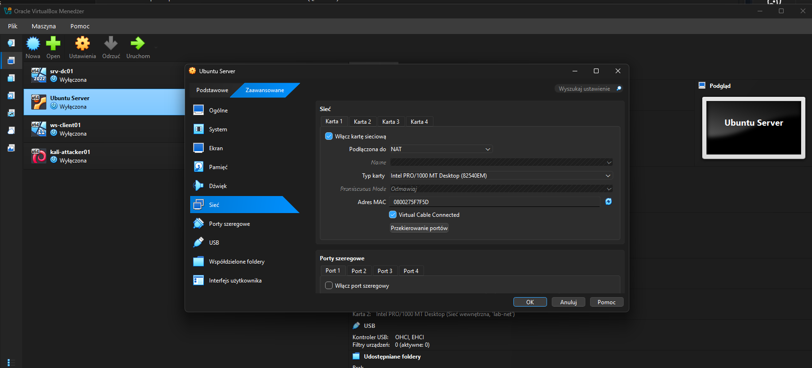

---

### Windows Client (ws-client01)

Internal Network:

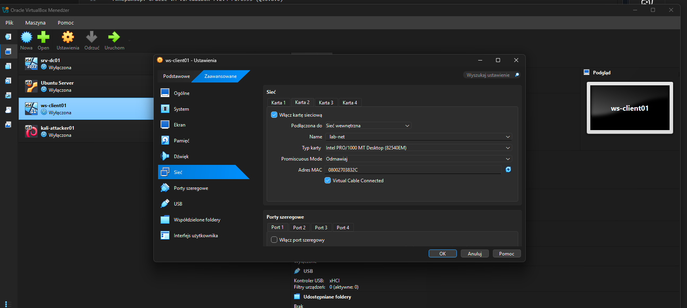

NAT:

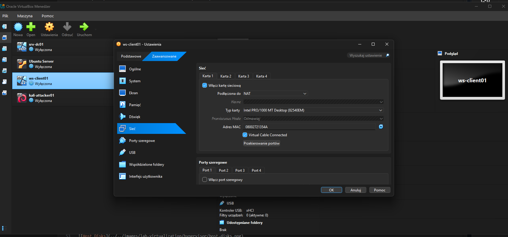

---

## Проверка сети (Kali Linux)

### IP адрес

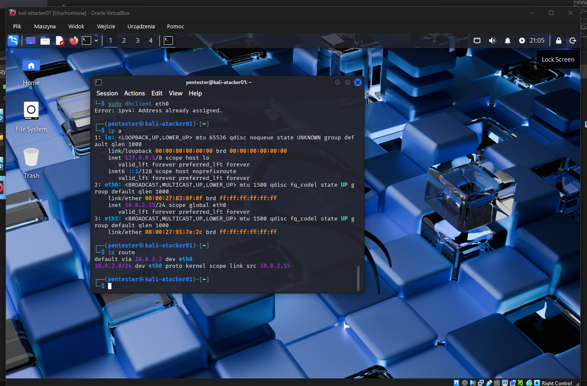

---

### Таблица маршрутизации

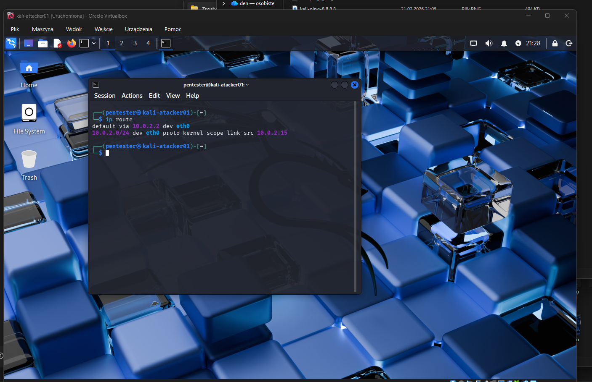

---

### Проверка доступа в интернет (IP)

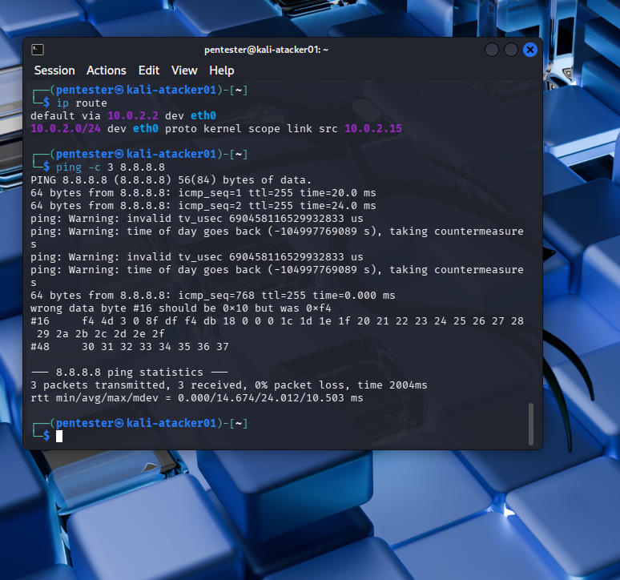

---

### Проверка DNS

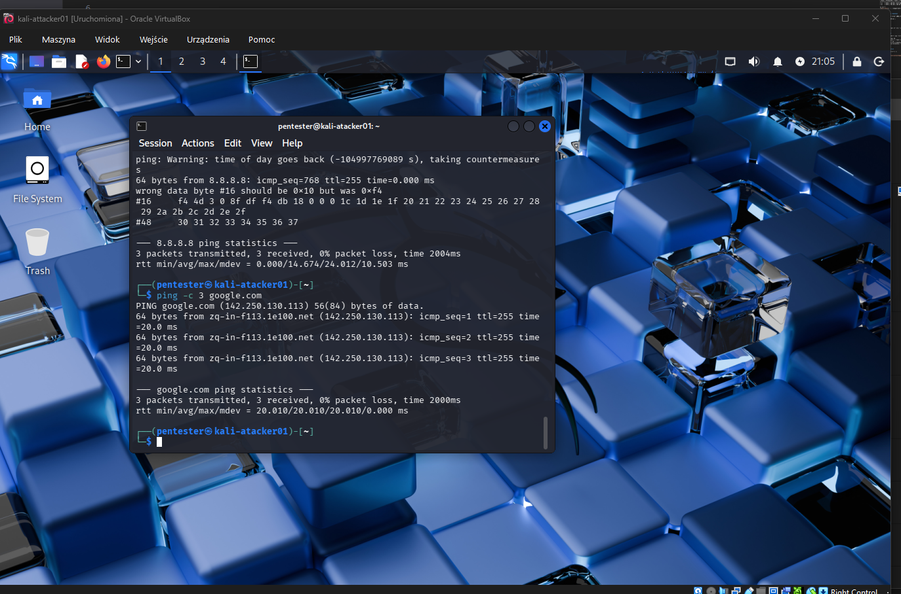

---

## Итоговая архитектура

            INTERNET
               |
          VirtualBox NAT
               |
   +-----------+-----------+
   |           |           |
  Kali      Windows      Ubuntu
               |
            Windows Client

## Итог

Лабораторная сеть успешно настроена:

- internet доступ через NAT — работает
- внутренняя сеть lab-net — настроена
- виртуальные машины подключены корректно
- конфигурация зафиксирована артефактами