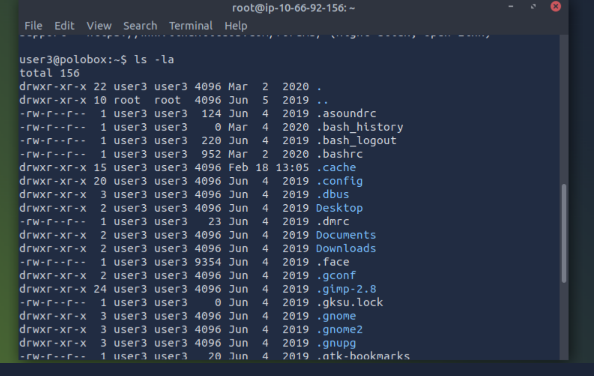
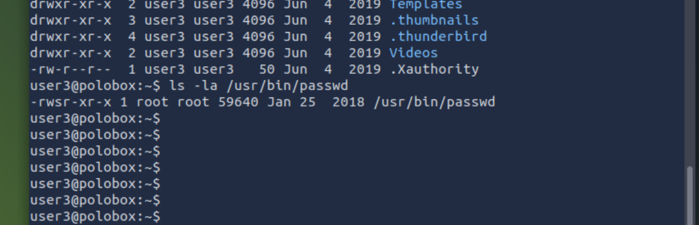
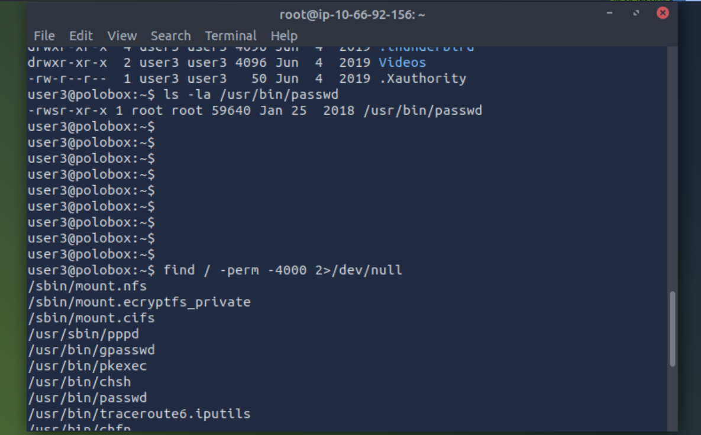
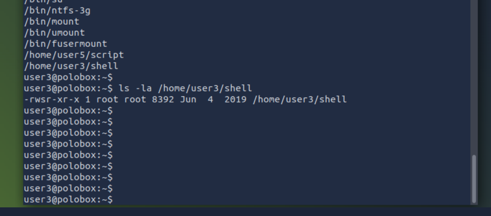

# Тема: Linux File Permissions и Special Bits (SUID, SGID, Sticky)

---

# Цель

Понять, как работает система прав доступа в Linux, как читать permissions, изменять их и почему это критически важно для безопасности и privilege escalation.

Научиться:

- читать symbolic permissions (-rwxr-xr-x)
- понимать numeric permissions (755, 4755)
- находить SUID файлы
- понимать потенциальные векторы privilege escalation

---

# Контекст

Где делал:

- TryHackMe lab
- домашняя lab (VirtualBox, Kali Linux, Ubuntu Server)
- learning-admin repository

Окружение:

- Kali Linux (attacker VM)
- Ubuntu Server (target VM)
- локальная виртуальная lab

---

# Ключевые понятия

Permission string  
Строка вида -rwxr-xr-x, которая показывает тип файла и права доступа.

Owner  
Пользователь, которому принадлежит файл.

Group  
Группа пользователей, которой принадлежит файл.

Others  
Все остальные пользователи системы.

Read (r)  
Право читать файл.

Write (w)  
Право изменять файл.

Execute (x)  
Право запускать файл как программу.

SUID (Set User ID)  
Позволяет запускать файл с правами владельца (например root), а не текущего пользователя.

Numeric permissions  
Числовая форма permissions (например 755, 4755).

---

# Главное (ключевые выводы)

1. Permissions состоят из 4 частей:

       [file type][owner][group][others]

   пример:

       -rwxr-xr-x

2. Символы означают:

       r = read
       w = write
       x = execute
       - = нет доступа

3. Numeric permissions:

       r = 4
       w = 2
       x = 1

   пример:

       rwx = 7
       r-x = 5

4. Пример:

       -rwxr-xr-x = 755

5. SUID обозначается как:

       -rwsr-xr-x

   numeric:

       4755

6. Если файл имеет SUID и принадлежит root → файл выполняется как root.

7. Это основной вектор privilege escalation в Linux.

8. Pentester должен всегда проверять SUID файлы.

---

# Что я реально понял

- Как читать symbolic permissions
- Как переводить symbolic ↔ numeric permissions
- Что означает SUID
- Почему SUID может привести к root privilege escalation
- Как pentester ищет потенциально опасные файлы

---

# Что было неочевидно

- Что обычный пользователь может выполнить файл как root через SUID
- Что execute permission не требует read permission
- Что numeric permissions содержат special bits (4000, 2000, 1000)

---

# Что оказалось важнее, чем я думал

SUID файлы — один из самых важных privilege escalation векторов.

Pentester всегда проверяет:

    find / -perm -4000 2>/dev/null

---

# Мини-практика / команды

Просмотр permissions:

    ls -la

Просмотр numeric permissions:

    stat filename

Изменение permissions:

    chmod 755 filename

Установка SUID:

    chmod 4755 filename

Поиск SUID файлов:

    find / -perm -4000 2>/dev/null

Поиск writable файлов:

    find / -writable 2>/dev/null

---

# Ошибки и грабли

Ошибка:

Не понимал разницу между owner, group и others.

Исправление:

Использовал:

    ls -la

и анализировал каждую часть permission string.

---

Ошибка:

Не понимал numeric permissions.

Исправление:

Разобрал mapping:

    r = 4
    w = 2
    x = 1

---

# Связь с пентестом

SUID файлы могут использоваться для privilege escalation.

Pentester проверяет:

    find / -perm -4000 2>/dev/null

Если найден уязвимый SUID файл → можно получить root shell.

Потенциальные векторы атаки:

- SUID find
- SUID bash
- SUID nano
- SUID python

---

# Где слабые места

Опасные permissions:

    -rwsr-xr-x

Особенно если файл:

- writable
- или запускает shell

---

# Связь с системным мышлением

Компоненты:

- файловая система
- пользователи
- группы
- процессы
- kernel permission model

Границы доверия:

user → file → root privilege boundary

SUID нарушает обычную границу доверия.

---

# Артефакты

artifacts/linux-permissions/

Добавить:

- скриншоты ls -la
- вывод find / -perm -4000
- примеры stat filename

---

# Следующий шаг

Изучить:

- Linux privilege escalation
- writable files exploitation
- SUID exploitation techniques

Практика:

- TryHackMe Linux PrivEsc rooms
- поиск и анализ SUID файлов в lab

Повторить:

- numeric permissions
- symbolic permissions
- chmod
- find

---

# Artifacts

## Basic permissions overview

Command:

    ls -la

---

## System SUID example

Command:

    ls -la /usr/bin/passwd

---

## SUID enumeration

Command:

    find / -perm -4000 2>/dev/null

---

## User SUID binary example

Command:

    ls -la /home/user3/shell

