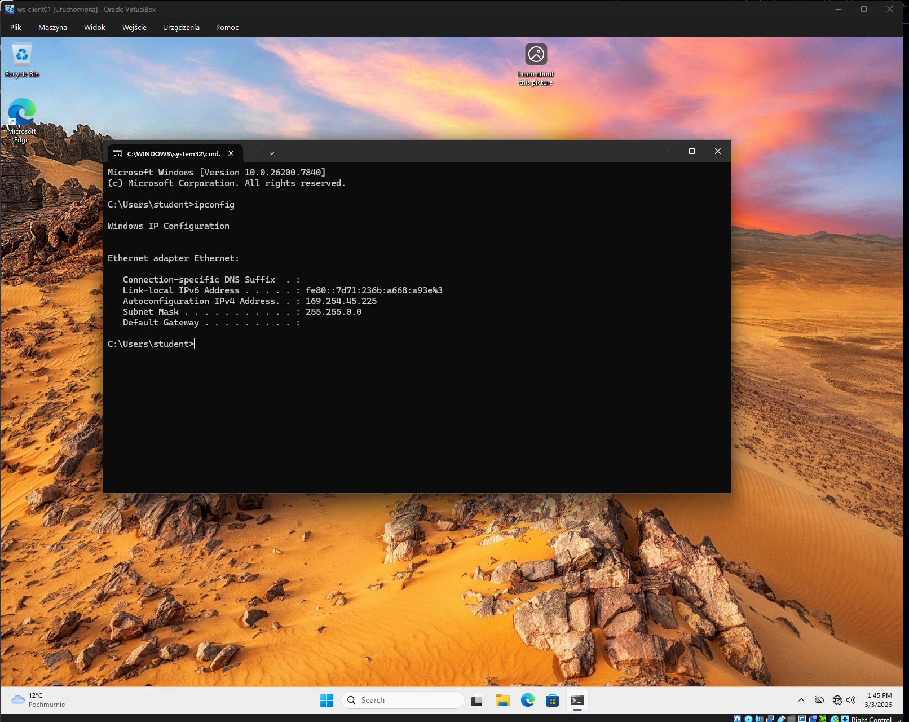
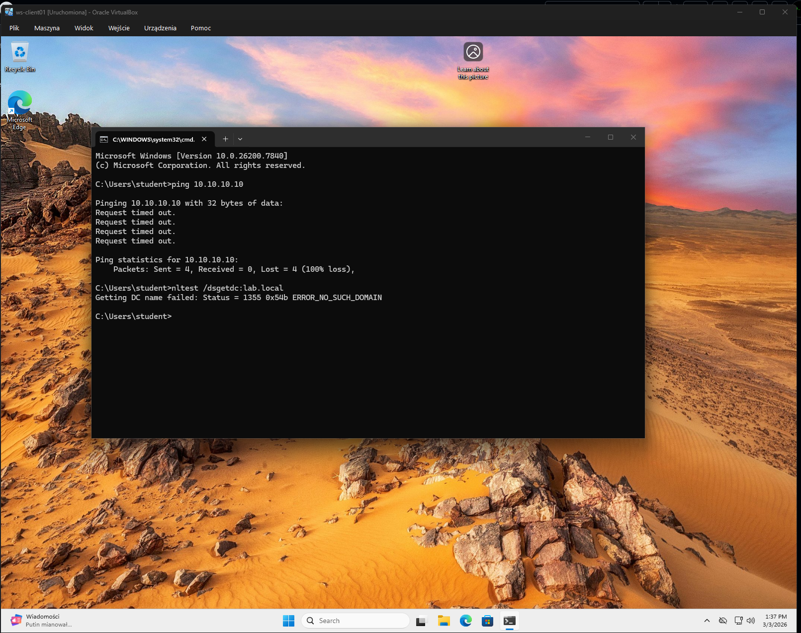
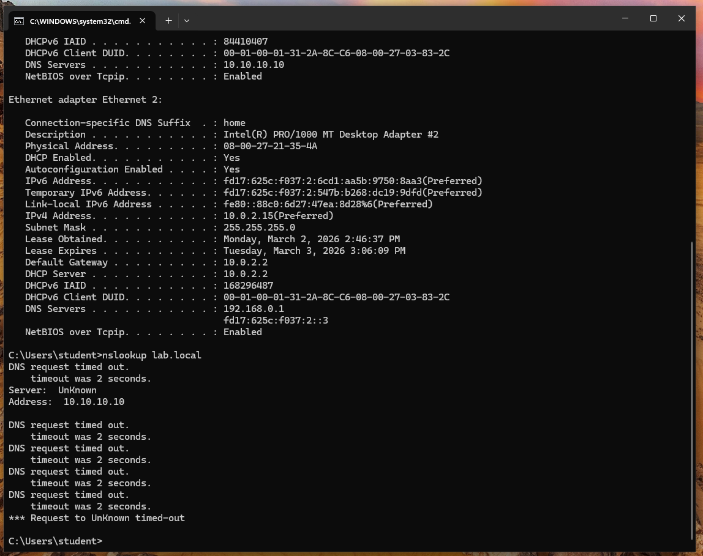
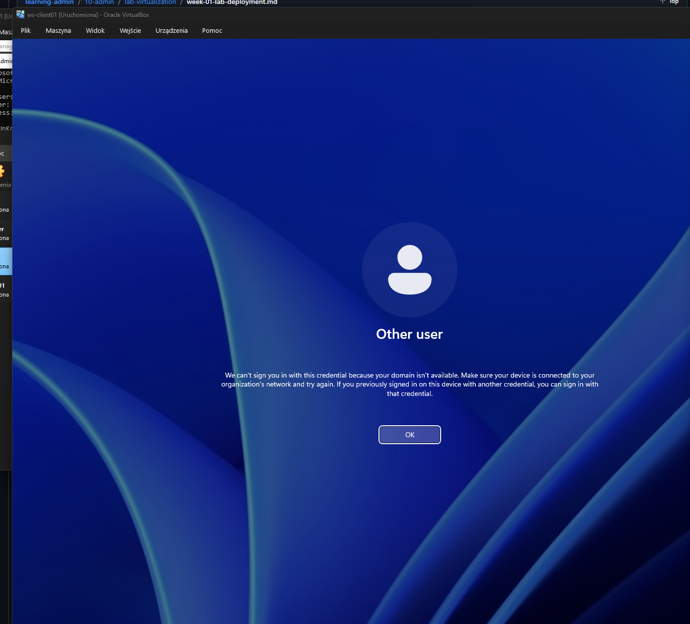
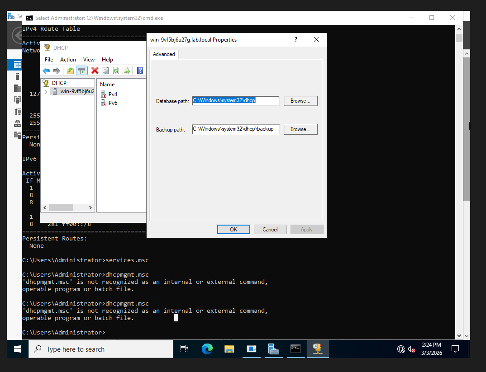
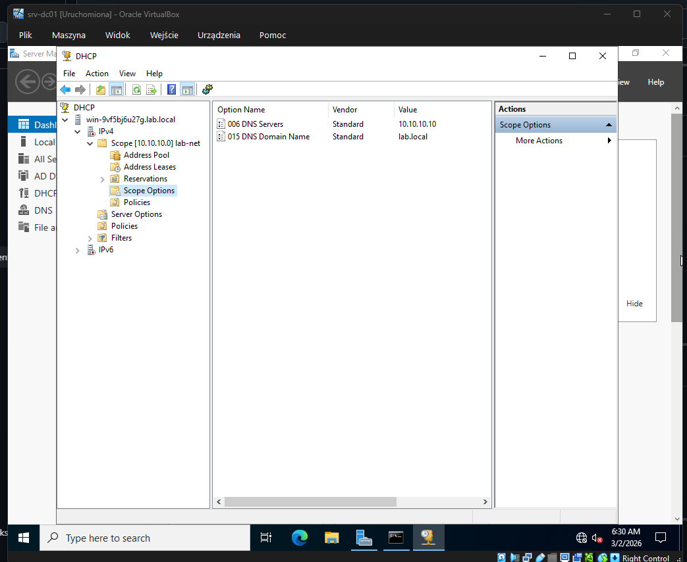
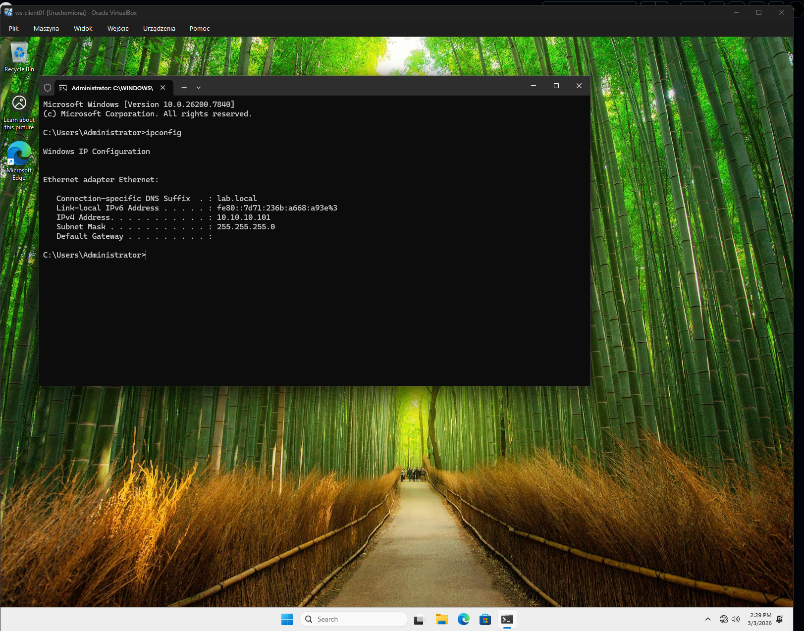
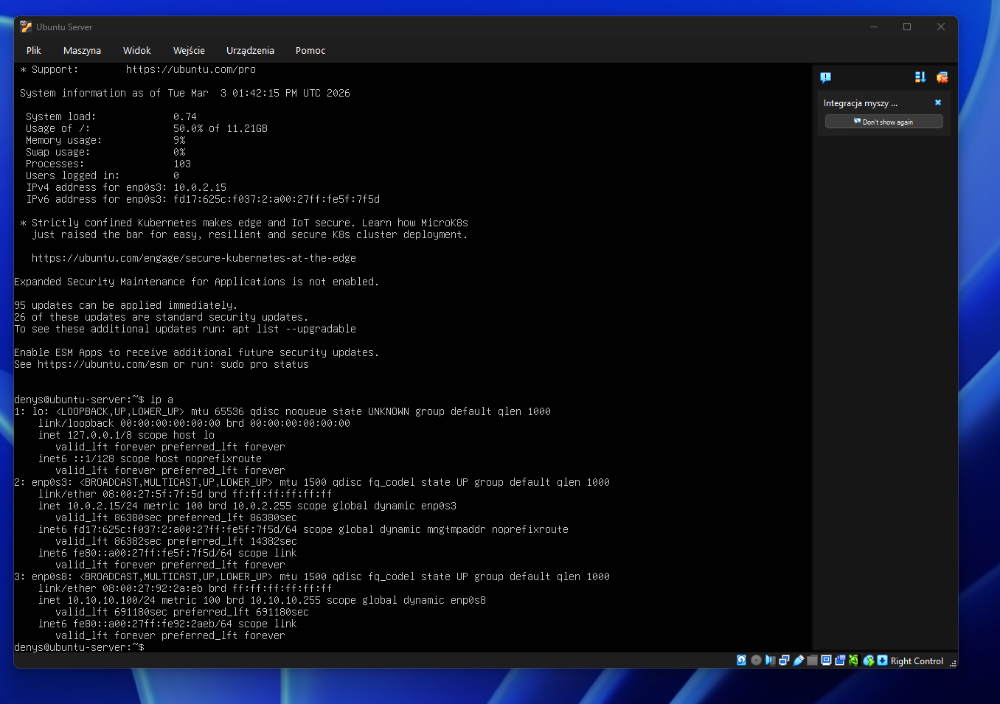

# DHCP Not Working After Domain Controller Promotion

## Description (EN)

Troubleshooting case where DHCP stopped working after promoting a Windows Server to a Domain Controller in a VirtualBox lab environment.

The issue caused clients to receive APIPA addresses and prevented domain communication. This document describes the symptoms, diagnostics, root cause and resolution.

---

## Контекст лаборатории

Гипервизор: VirtualBox  
Сеть: Internal Network `lab-net`  

Инфраструктура:

| Host | Role |
|-----|-----|
| srv-dc01 | Domain Controller + DNS + DHCP |
| ws-client01 | Windows Client |
| ubuntu-srv | Ubuntu Server |

Домен:

lab.local

---

## Проблема

После повышения Windows Server до Domain Controller DHCP перестал выдавать IP-адреса клиентам.

Windows клиент получал APIPA адрес из диапазона `169.254.x.x`, что означает отсутствие DHCP сервера.

Linux сервер также не получал IP адрес из сети лаборатории.

---

## Симптомы

### Клиент получает APIPA адрес

---

### Невозможно связаться с контроллером домена

---

### DNS запросы не работают

---

### Невозможно войти в домен

---

## Диагностика

При проверке DHCP сервера было обнаружено, что IPv4 сервис не активирован.

---

Также были проверены настройки DHCP scope и DNS параметров.

---

## Причина

После повышения сервера до Domain Controller DHCP IPv4 сервис оказался неактивным.

Из-за этого DHCP сервер не выдавал IP адреса клиентам.

---

## Решение

Был активирован DHCP IPv4 и перезапущена работа DHCP сервера.

После этого клиенты начали получать IP адреса из DHCP scope.

---

## Результат

### Windows клиент получил IP адрес

---

### Успешный вход в систему

---

### Ubuntu сервер получил IP адрес от DHCP

---

## Итог

DHCP перестал работать из-за неактивного IPv4 сервиса после повышения сервера до Domain Controller.

После активации DHCP IPv4 клиенты начали корректно получать IP адреса и смогли взаимодействовать с доменом.