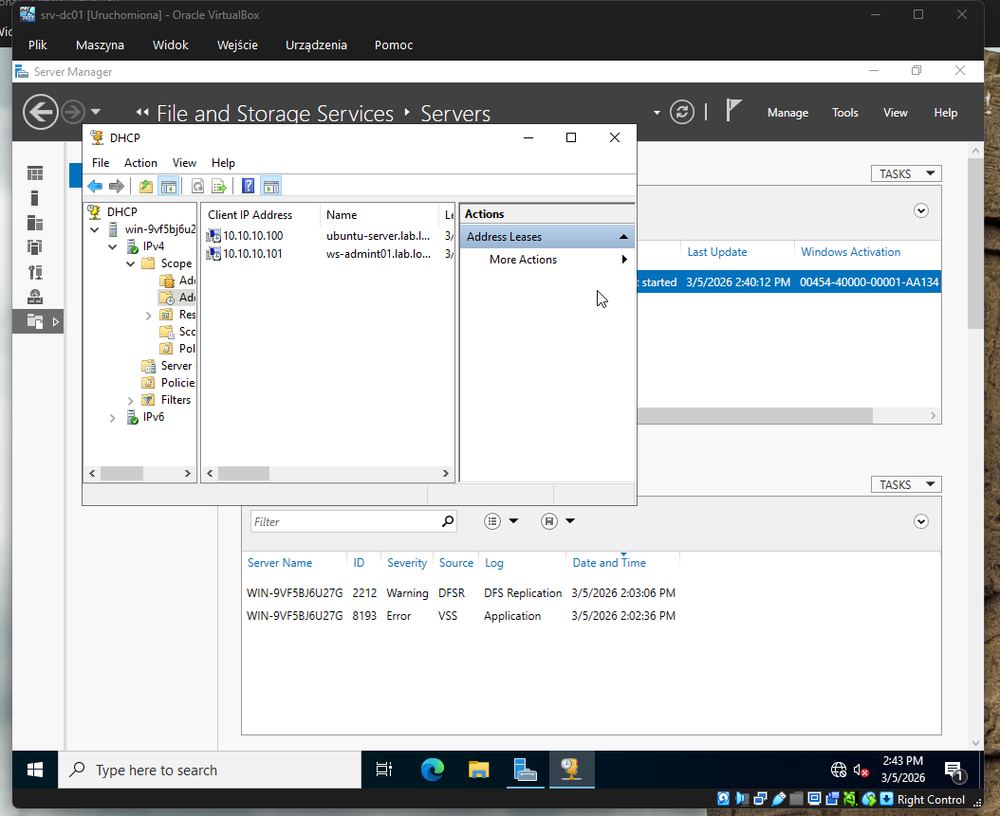
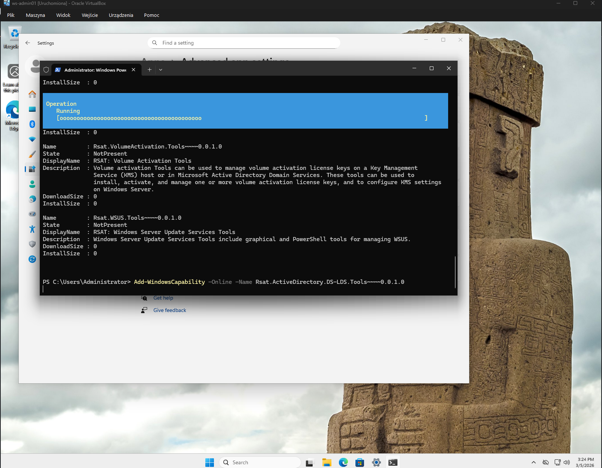
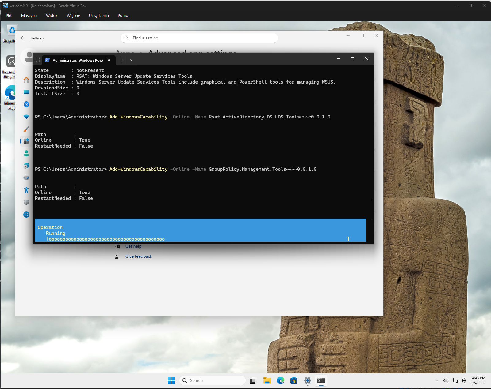
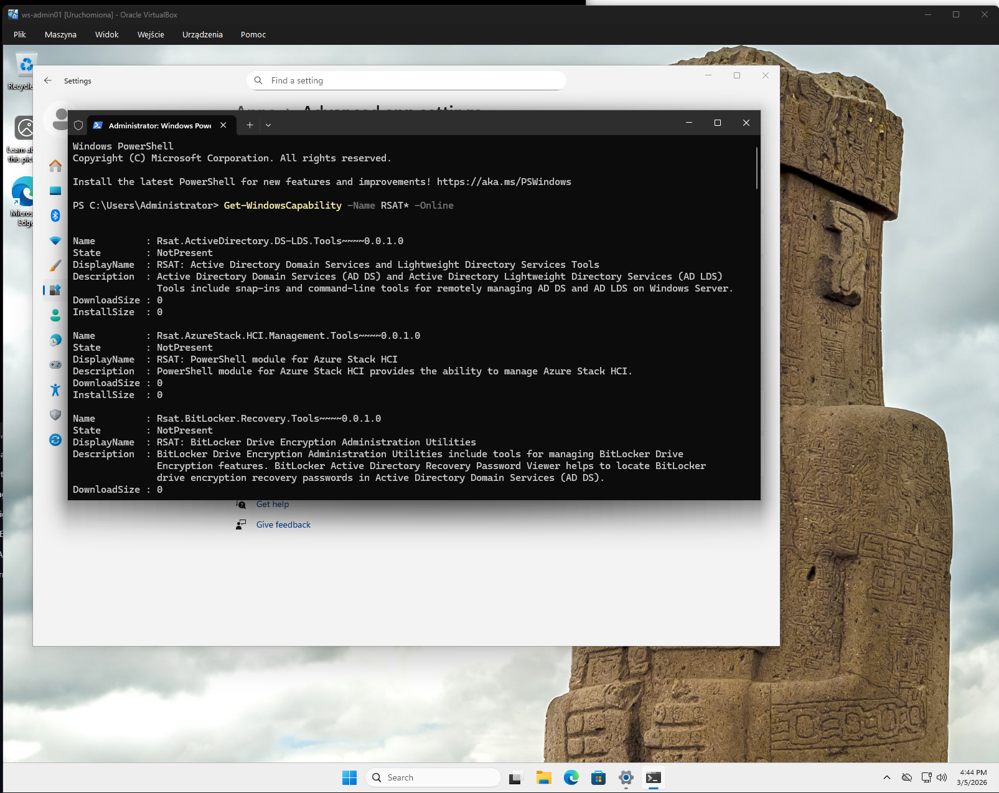
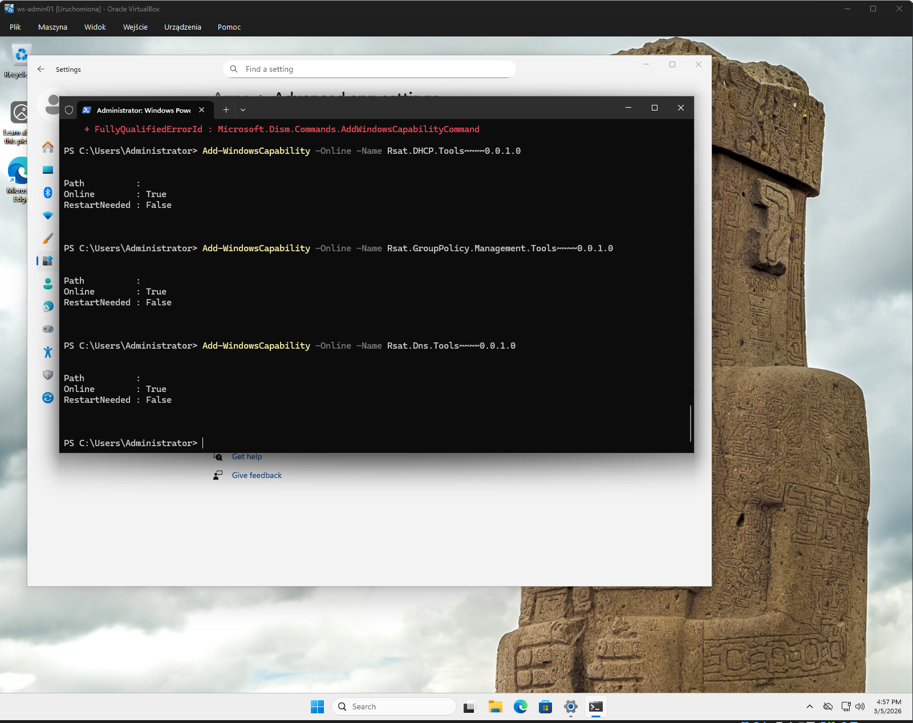
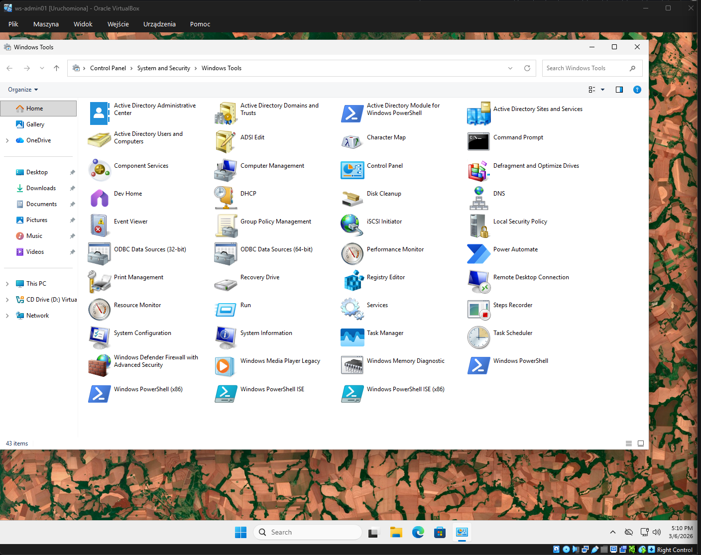

# Admin Workstation Setup

**Short description (EN):**  
Preparation of a dedicated Windows administrator workstation used to remotely manage the domain environment using RSAT tools (Active Directory, DNS, DHCP, Group Policy).

---

# Подготовка административной рабочей станции

## Цель

Подготовить отдельную рабочую станцию администратора для удалённого управления инфраструктурой домена.

В корпоративной среде администраторы обычно **не работают напрямую на контроллере домена**, а используют отдельную административную машину с установленными инструментами управления.

В лаборатории эту роль выполняет машина **ws-admin01**.

---

# Переименование рабочей станции

Изначально Windows-клиент был переименован в **ws-admin01**, чтобы обозначить его роль как административной рабочей станции.

После переименования имя машины стало отображаться на DHCP сервере.

---

# Установка RSAT инструментов

Для удалённого администрирования Windows Server были установлены **RSAT (Remote Server Administration Tools)**.

Установленные компоненты:

- Active Directory Domain Services Tools
- Group Policy Management Tools
- DNS Tools
- DHCP Tools

Установка выполнялась через PowerShell.

Пример команды:

Add-WindowsCapability -Online -Name Rsat.ActiveDirectory.DS-LDS.Tools~~~~0.0.1.0

---

# Процесс установки инструментов

Установка RSAT инструментов выполнялась через PowerShell.

### Active Directory Tools

### Group Policy Tools

---

# Проверка доступных RSAT компонентов

Перед установкой была выполнена проверка доступных RSAT компонентов.

---

# Подтверждение успешной установки

После выполнения команд PowerShell установка RSAT инструментов завершилась успешно.

---

# Проверка доступности инструментов

После установки инструменты администрирования стали доступны в **Windows Tools**.

---

# Результат

Рабочая станция **ws-admin01** успешно подготовлена для удалённого администрирования инфраструктуры.

С данной машины теперь можно управлять:

- Active Directory
- Group Policy
- DNS
- DHCP

без необходимости входа напрямую на контроллер домена.