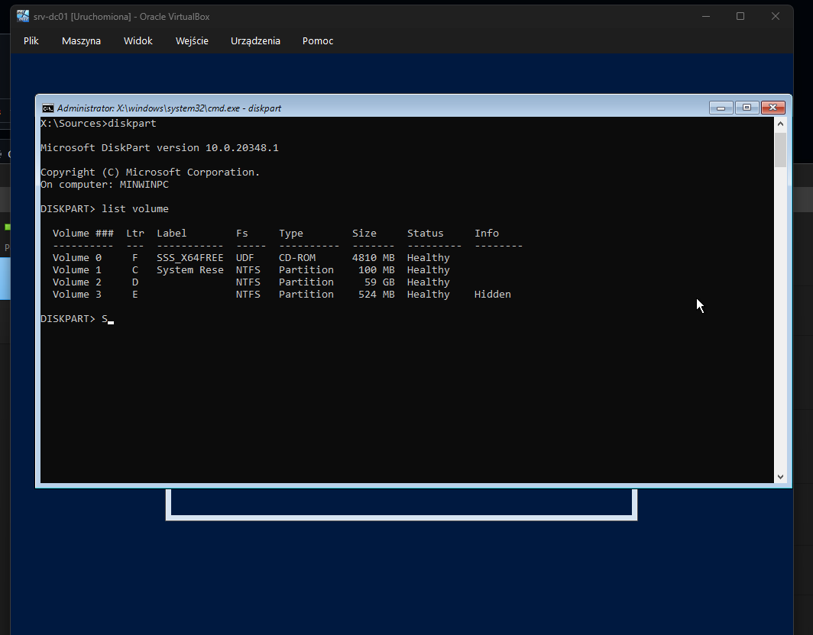
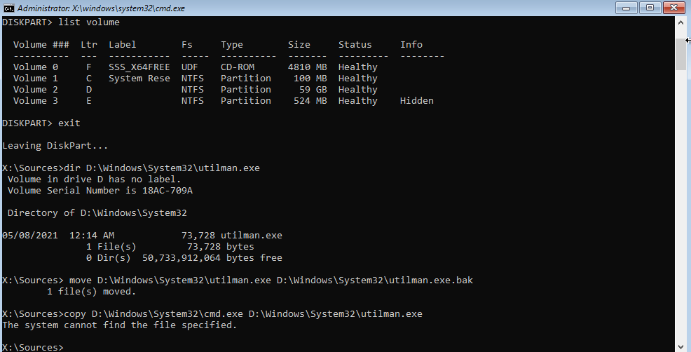
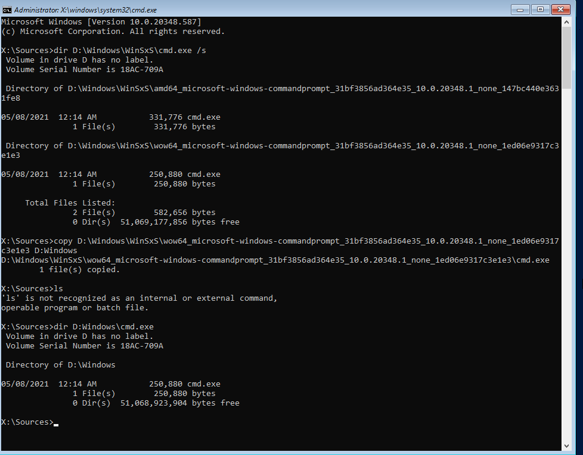
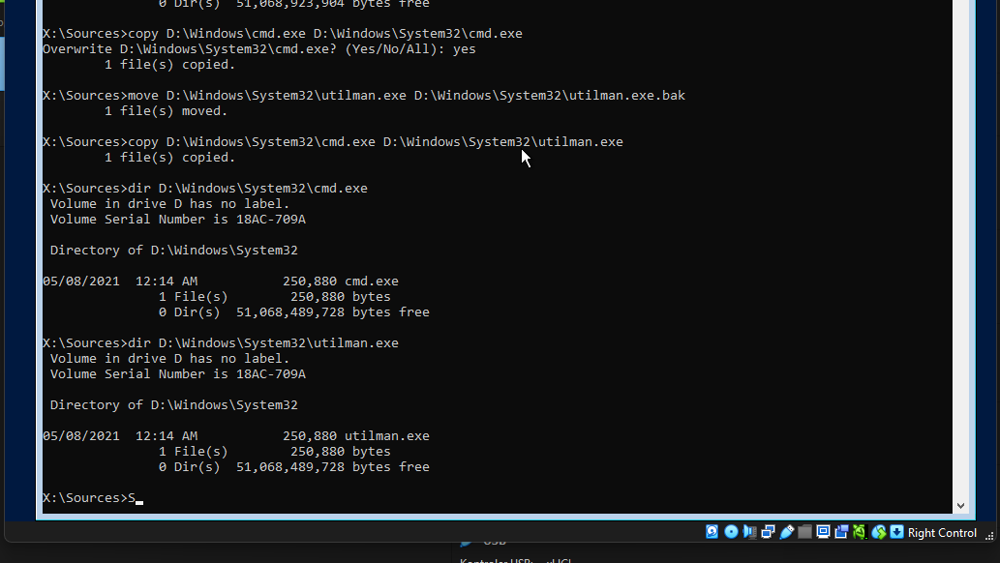
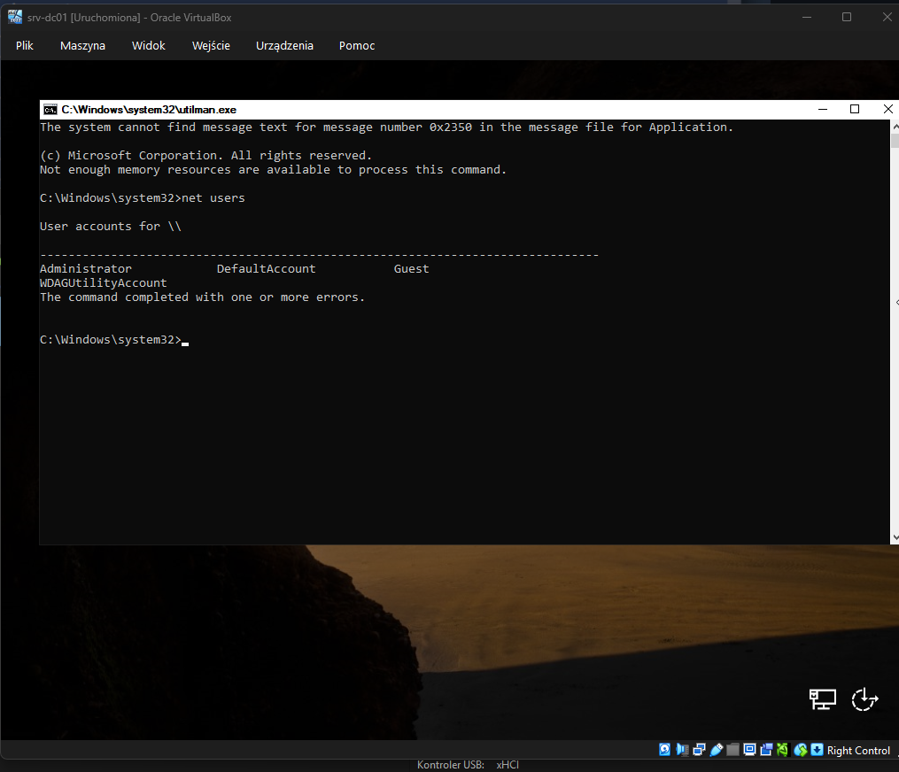
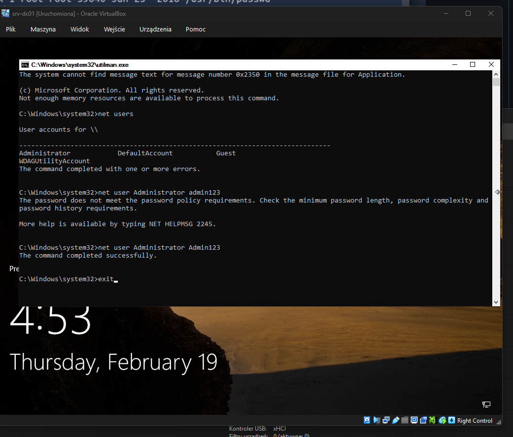
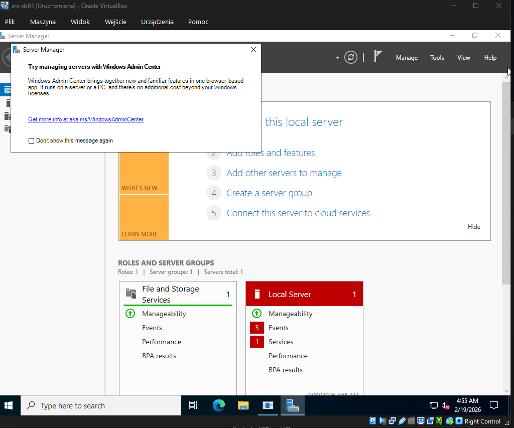

# Windows Server Password Recovery via utilman.exe Replacement

---

# 🇷🇺 Описание

В данной лабораторной работе выполнено восстановление пароля администратора Windows Server с использованием техники замены utilman.exe на cmd.exe через Recovery Environment.

Это позволило получить SYSTEM shell на экране входа и изменить пароль администратора.

Среда: VirtualBox, Windows Server 2022

---

# Шаг 1 — загрузка в Recovery Environment

Система загружена с установочного ISO Windows Server и открыта командная строка Recovery Environment.



---

# Шаг 2 — определение раздела Windows

Определение раздела Windows:

```
diskpart
list volume
exit
```

Windows установлена на диске D:


---

# Шаг 3 — создание резервной копии utilman.exe

Создание резервной копии:

```
move D:\Windows\System32\utilman.exe D:\Windows\System32\utilman.exe.bak
```



---

# Шаг 4 — восстановление оригинального cmd.exe

Поиск оригинального cmd.exe:

```
dir D:\Windows\WinSxS\cmd.exe /s
```

Копирование:

```
copy D:\Windows\WinSxS\...\cmd.exe D:\Windows\System32\cmd.exe
```



---

# Шаг 5 — замена utilman.exe на cmd.exe

Замена utilman.exe:

```
copy D:\Windows\System32\cmd.exe D:\Windows\System32\utilman.exe
```



---

# Шаг 6 — получение SYSTEM shell

После перезагрузки нажата кнопка специальных возможностей.

Открылась Command Prompt с правами SYSTEM.



---

# Шаг 7 — просмотр пользователей

Просмотр пользователей:

```
net users
```


---

# Шаг 8 — изменение пароля администратора

Изменение пароля:

```
net user Administrator Admin123
```

Пароль успешно изменён.



---

# Шаг 9 — успешный вход в систему

Успешный вход в систему администратора.



---

# Шаг 10 — восстановление utilman.exe

Восстановление оригинального файла:

```
move C:\Windows\System32\utilman.exe.bak C:\Windows\System32\utilman.exe
```

---

# Результат

Успешно выполнено:

* получен SYSTEM shell
* изменён пароль администратора
* восстановлен доступ к системе
* восстановлены системные файлы

---

# Вывод

Данная техника демонстрирует критическую важность:

* Physical security
* BitLocker
* Access control

Любой пользователь с физическим доступом может получить полный контроль над системой.

---

# 🇬🇧 English Version

This lab demonstrates Windows Server Administrator password recovery using utilman.exe replacement technique.

Steps performed:

* Boot into recovery environment
* Locate Windows partition
* Backup utilman.exe
* Restore original cmd.exe
* Replace utilman.exe with cmd.exe
* Obtain SYSTEM shell
* Change Administrator password
* Restore utilman.exe

Password recovery completed successfully.

---

# Artifacts

```
10-admin/windows/artifacts/password-recovery-utilman/
```

---

# Status

Completed successfully.

---
