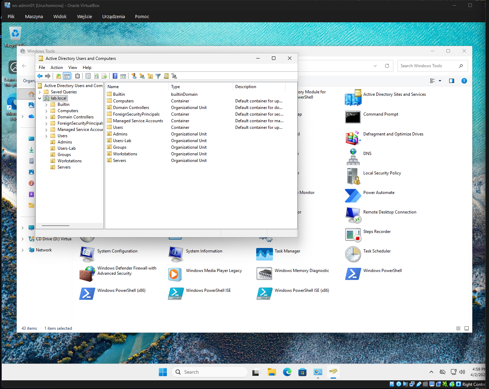
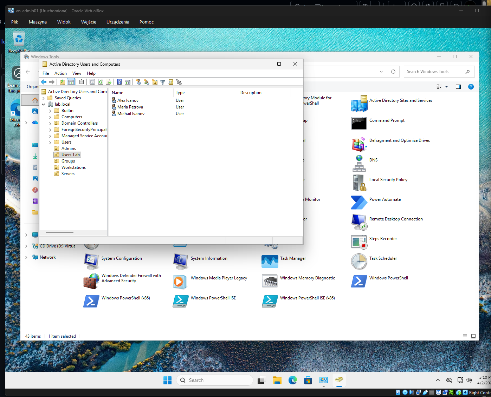
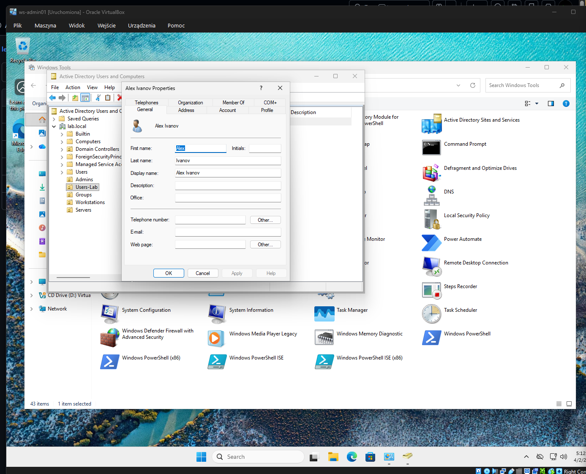
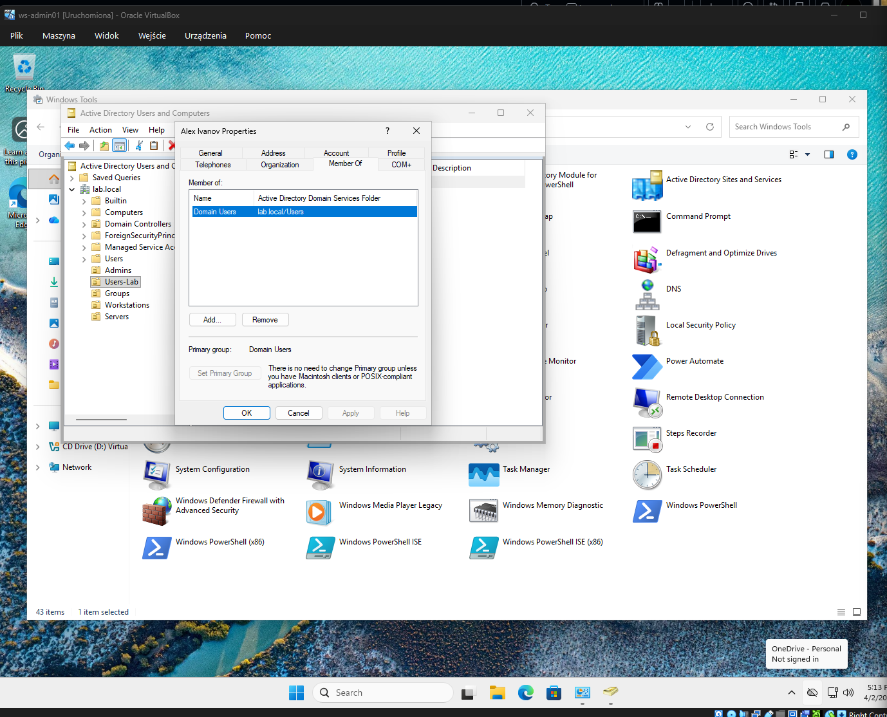
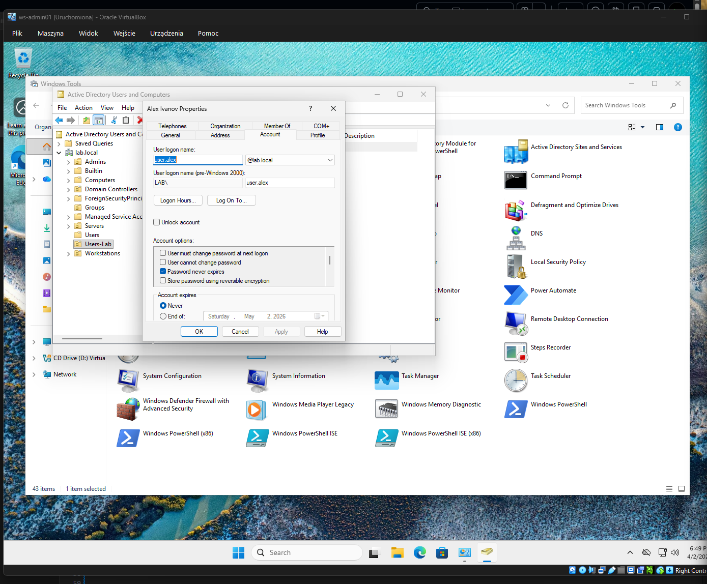
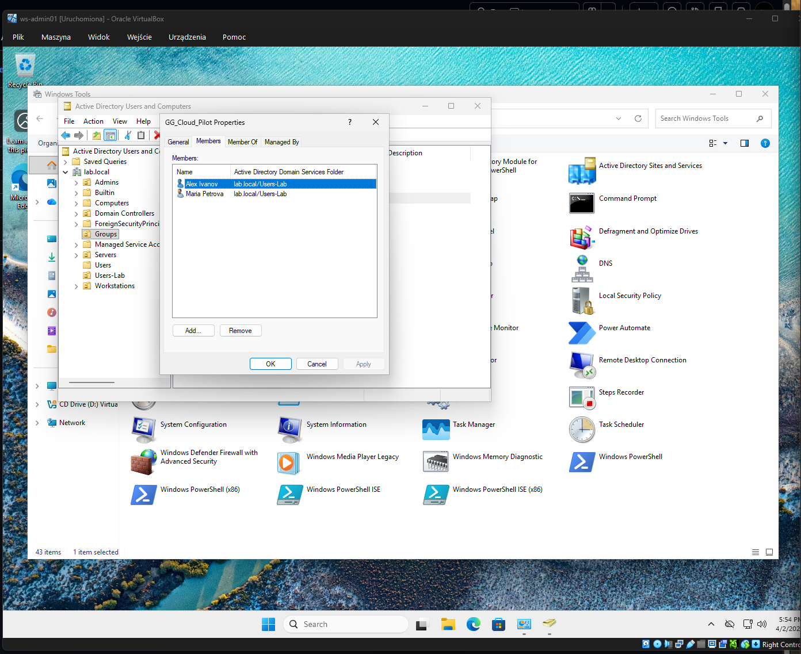
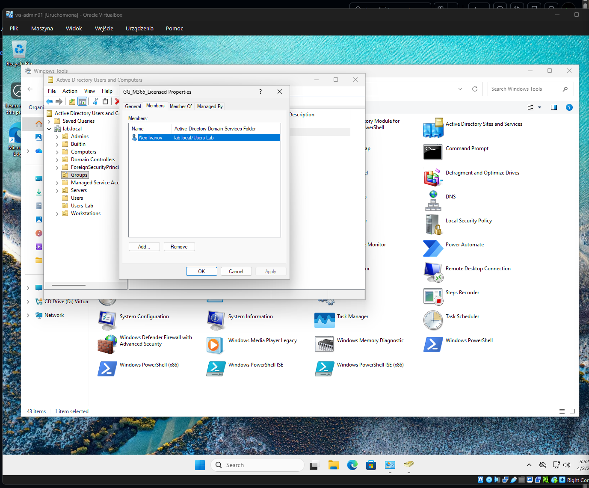
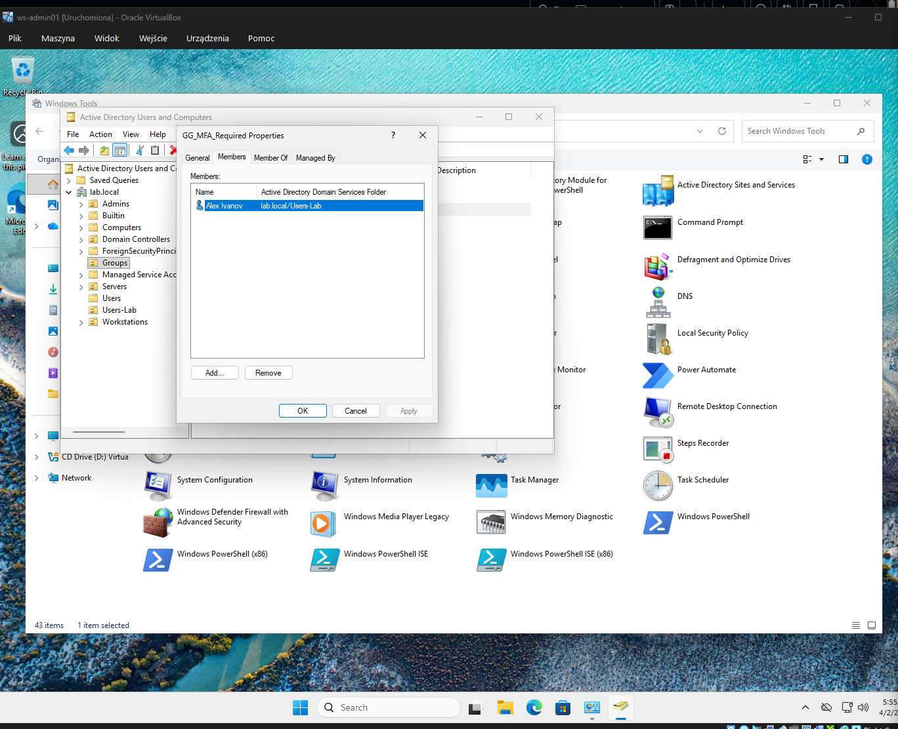

# День 1: Настройка базовой структуры Active Directory

## Overview (EN)
Setup basic AD structure, users, and security groups via admin workstation (ws-admin01) to prepare for hybrid synchronization with Microsoft 365.

## Описание (RU)
Создана структура Organizational Units (OU), добавлены пользователи и группы. Работа выполнена через админскую машину (ws-admin01), чтобы подготовить лабораторию к синхронизации с Microsoft 365. Сделаны разные сценарии пользователей для демонстрации синка, лицензий и MFA.

---

## OU Structure
- **Admins** — администраторы
- **Users-Lab** — обычные пользователи
- **Groups** — контейнер для групп
- **Workstations** — рабочие станции
- **Servers** — серверы

**Artifacts:**
- 

---

## Users
| Username        | Display Name   | OU        | Notes |
|-----------------|---------------|-----------|-------|
| adm.denys       | Denys Admin   | Admins    | Domain Admin |
| user.alex       | Alex Ivanov   | Users-Lab | полный sync + лицензия + MFA |
| user.maria      | Maria Petrova | Users-Lab | sync только |
| user.test1      | Michail Ivanov| Users-Lab | не в группах — тестовый |

**Artifacts:**
-   
-   
-   
- 

---

## Groups
| Group Name       | Purpose |
|-----------------|---------|
| GG_Cloud_Pilot   | Pilot sync to M365 |
| GG_M365_Licensed | Assign licenses |
| GG_MFA_Required  | MFA / Conditional Access |
| GG_IT_Admins     | Admins only |

### Members
- **GG_Cloud_Pilot** → user.alex, user.maria  
- **GG_M365_Licensed** → user.alex  
- **GG_MFA_Required** → user.alex  
- **GG_IT_Admins** → adm.denys

**Artifacts:**
-   
-   
- 

---

## Verification
- Проверено, что пользователи созданы в правильной OU.  
- Проверено, что админ отдельный и состоит в Domain Admins.  
- Проверено, что пользователи добавлены в группы согласно сценарию:

user.alex  → 3 группы (sync + лицензия + MFA)
user.maria → 1 группа (sync only)
user.test1 → 0 групп (тестовый)
adm.denys  → admin only

