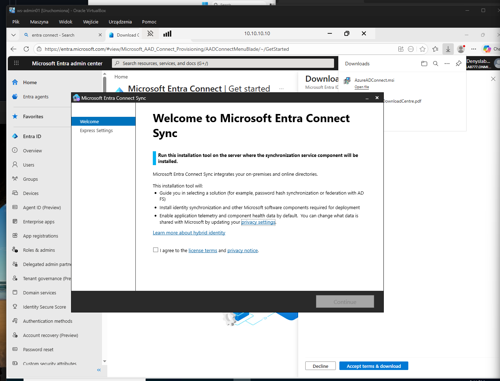
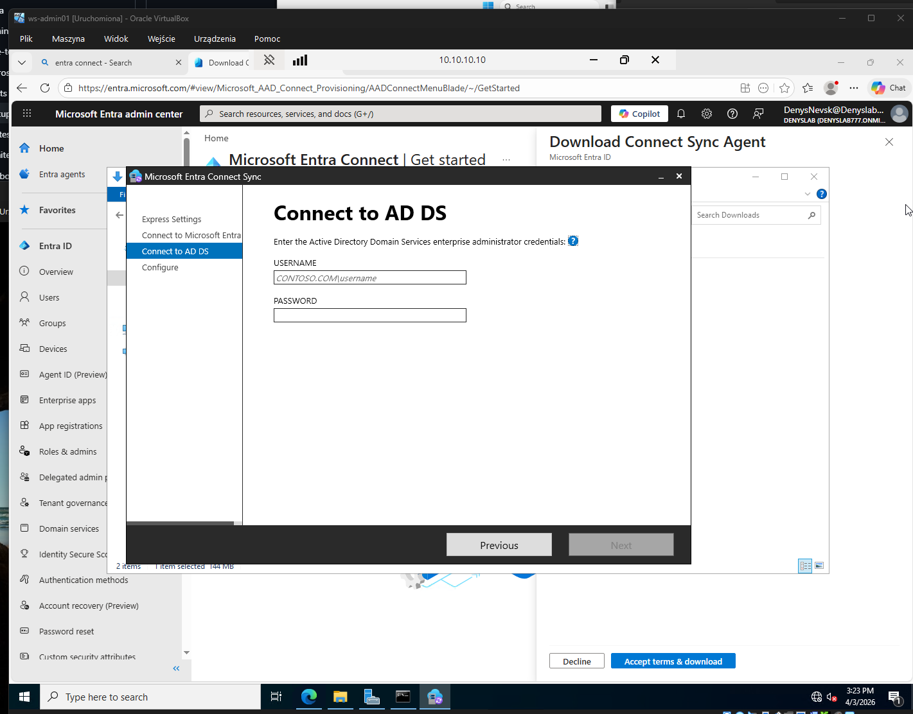
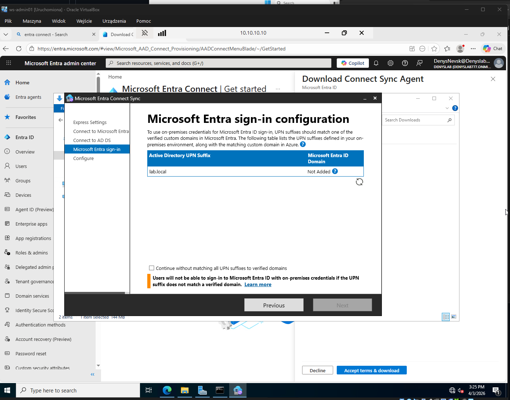
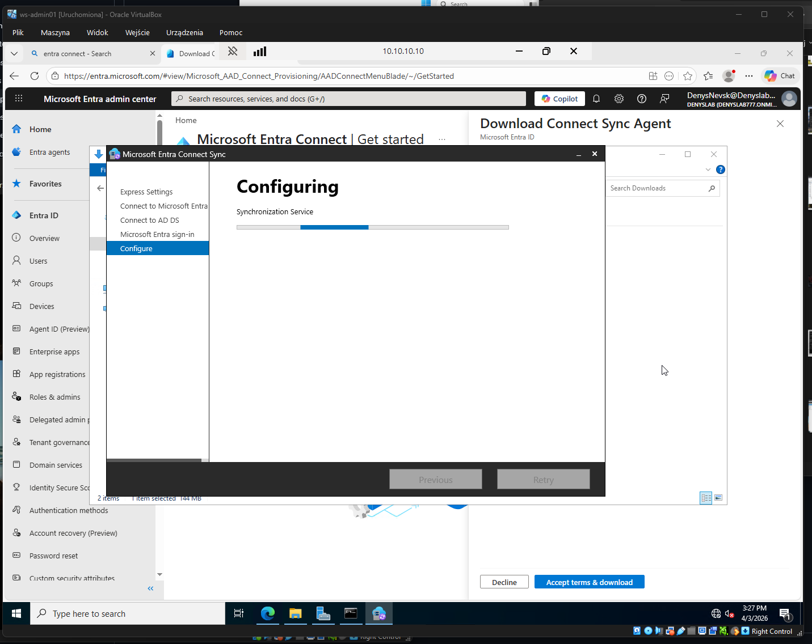
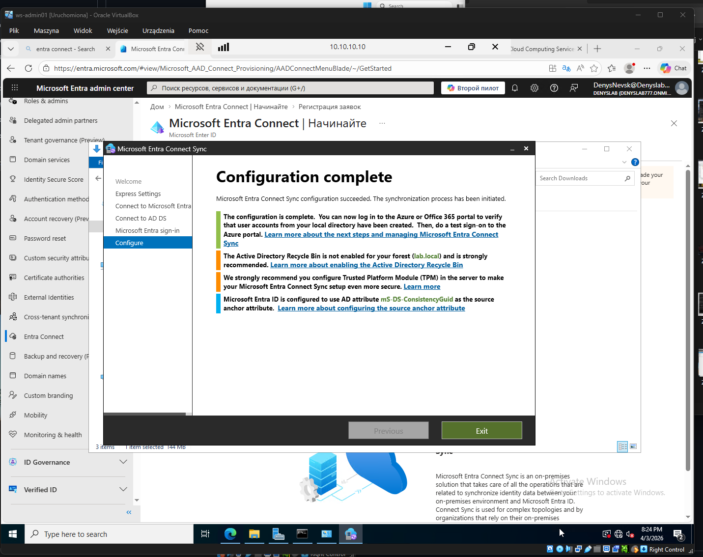
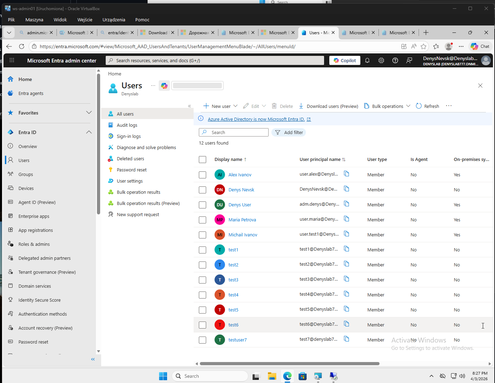
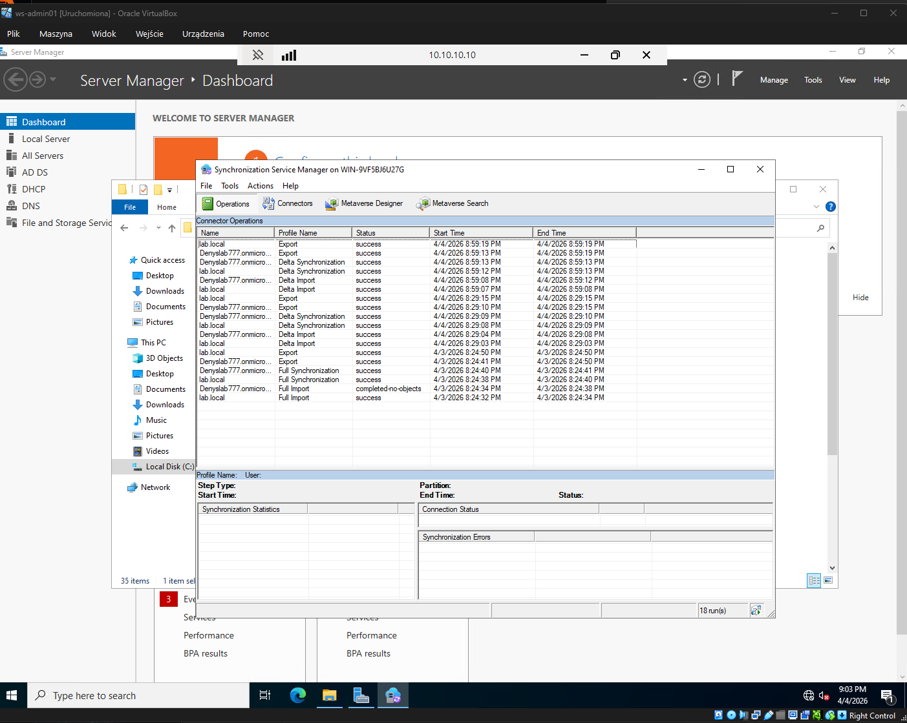

# AD Connect Sync in Hybrid Identity Lab

**Short English summary:**  
This lab case demonstrates how I integrated on-premises Active Directory (`lab.local`) with Microsoft Entra ID using Microsoft Entra Connect Sync. I configured the synchronization service, connected the local AD to the cloud tenant, resolved an installation issue caused by an incomplete previous setup and incorrect time synchronization, and verified successful user synchronization in both Entra ID and Synchronization Service Manager.

---

# Microsoft Entra Connect Sync в гибридной лаборатории

## Цель

Настроить синхронизацию между локальным Active Directory (`lab.local`) и Microsoft Entra ID, чтобы пользователи из on-premises AD автоматически появлялись в облаке.

---

## Что использовалось

- **On-premises AD:** `lab.local`
- **Domain Controller:** `srv-dc01`
- **Admin workstation:** `ws-admin01`
- **Cloud tenant:** Microsoft 365 / Microsoft Entra ID
- **Инструмент синхронизации:** Microsoft Entra Connect Sync

---

## Что было сделано

1. На сервере была выполнена установка **Microsoft Entra Connect Sync**.
2. В мастере установки была выбрана стандартная настройка синхронизации.
3. Выполнено подключение к:
   - **Microsoft Entra ID**
   - **локальному Active Directory Domain Services**
4. На этапе проверки UPN было подтверждено, что локальный суффикс `lab.local` не является проверенным доменом в Entra ID.
5. Конфигурация синхронизации была завершена, и процесс синхронизации был запущен.
6. После завершения настройки было проверено:
   - появление пользователей из AD в Microsoft Entra ID
   - успешное выполнение циклов Import / Synchronization / Export в **Synchronization Service Manager**

---

## Проблема в процессе настройки

Во время первой попытки установки Microsoft Entra Connect Sync возникла ошибка.

### Причина
Проблема была связана с двумя факторами:

1. **Некорректная синхронизация времени**
   - контроллер домена использовал `Local CMOS Clock`
   - из-за этого возникали проблемы с аутентификацией и сертификатами

2. **Незавершённая предыдущая установка**
   - в системе остались остаточные данные предыдущего failed install
   - папка:
     `C:\ProgramData\AADConnect`

### Что было сделано для исправления

1. На контроллере домена был настроен внешний источник времени:
   - `time.windows.com`
2. Служба времени была перезапущена и синхронизирована.
3. На `ws-admin01` была выполнена повторная синхронизация времени с контроллером домена.
4. Была удалена остаточная папка:
   - `C:\ProgramData\AADConnect`
5. После этого Microsoft Entra Connect Sync был установлен заново и успешно завершил конфигурацию.

---

## Результат

В результате настройки:

- пользователи из локального AD появились в Microsoft Entra ID
- у синхронизированных пользователей отображается:
  - **On-premises sync = Yes**
- в **Synchronization Service Manager** видно успешное выполнение операций:
  - Import
  - Delta Synchronization
  - Export

Это подтверждает, что гибридная синхронизация между локальной инфраструктурой и облаком работает корректно.

---

## Что важно понимать

### 1. Локальные и облачные пользователи отличаются
После настройки в tenant могут существовать два типа пользователей:

- **On-premises synced users**
  - создаются и управляются в локальном AD
  - синхронизируются в Entra ID
- **Cloud-only users**
  - создаются напрямую в Entra ID
  - не связаны с локальным AD

### 2. Синхронизированных пользователей нельзя полноценно редактировать в облаке
Если пользователь пришёл из локального AD, то основные изменения выполняются именно в AD, а не в Entra ID.

### 3. Это уже реальный гибридный сценарий
Это не просто создание пользователей в облаке, а полноценная связка:

`On-prem AD -> Microsoft Entra Connect Sync -> Microsoft Entra ID`

---

## Артефакты

- 
- 
- 
- 
- 
- 
- 

---

## Вывод

В лаборатории была успешно реализована гибридная идентификация между локальным Active Directory и Microsoft Entra ID через Microsoft Entra Connect Sync.

Я не только довёл установку до рабочего состояния, но и отдельно устранил проблему с failed setup:
- проверил время в домене
- исправил источник времени на контроллере
- очистил остатки незавершённой установки
- повторно выполнил конфигурацию

Итоговый результат подтверждён:
- в облаке появились синхронизированные пользователи
- в Synchronization Service Manager видны успешные циклы синхронизации
