# Conditional Access — Require Compliant Device

## Overview (EN)
This lab demonstrates how Conditional Access evaluates device compliance using Microsoft Intune. 
Access is granted only if the device is marked as compliant, combining identity (user authentication) 
and device state to make access decisions.

## Описание (RU)
В этом кейсе показано, как Conditional Access принимает решение о доступе на основе соответствия устройства (compliance) через Microsoft Intune. 
Доступ предоставляется только в том случае, если устройство считается соответствующим требованиям, 
что объединяет проверку пользователя и состояние устройства.

## Lab Context
- On-prem Active Directory
- Microsoft Entra ID (hybrid identity via Entra Connect)
- Microsoft Intune (MDM)
- Conditional Access policies
- Admin workstation: ws-admin01

## Scenario Goal
Проверить, как Conditional Access принимает решение о доступе на основе:
- MFA (аутентификация пользователя)
- Device compliance (состояние устройства)

## Step 1 — Conditional Access Policy

В системе настроена политика Conditional Access, которая контролирует доступ к облачным ресурсам.

Доступ предоставляется только при выполнении двух условий:
- пользователь успешно проходит аутентификацию (MFA)
- устройство помечено как compliant (соответствующее требованиям)

Это означает, что доступ зависит не только от пользователя, но и от состояния устройства.

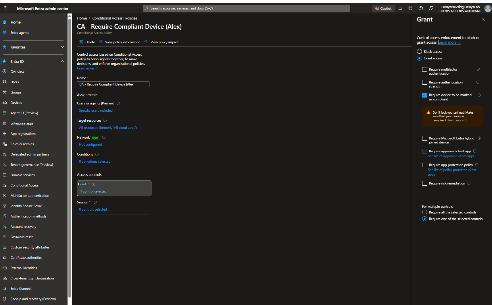

## Step 2 — Scenario 1 (Domain VM)

Доменное устройство (Virtual Machine), подключённое к Active Directory и зарегистрированное в Entra ID.

### Basic Info

Успешный вход пользователя с использованием MFA.

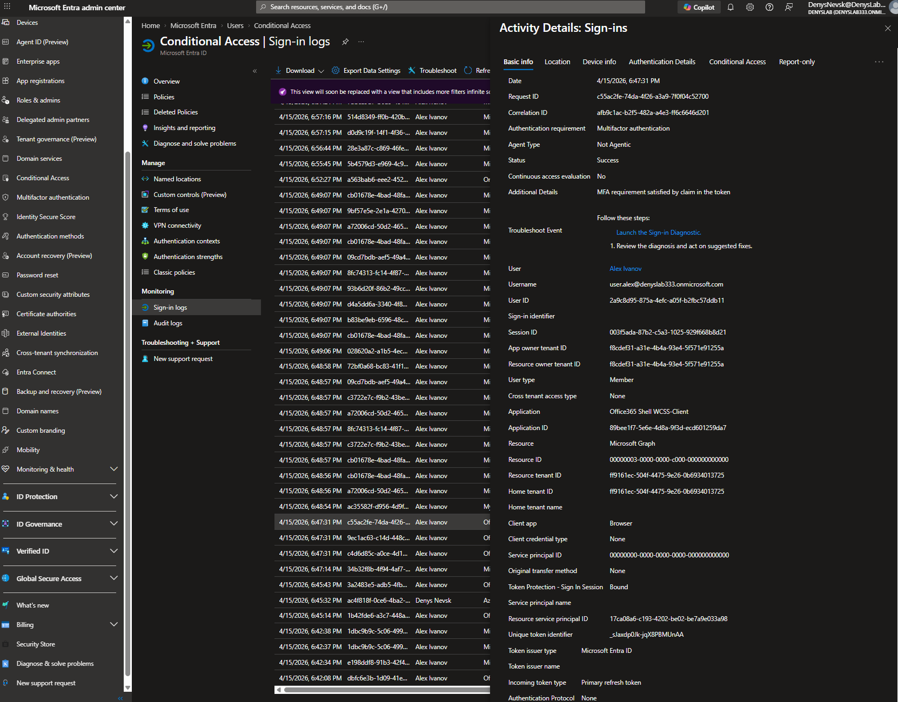

---

### Conditional Access

Политика Conditional Access успешно применена.
Требование compliant устройства выполнено.

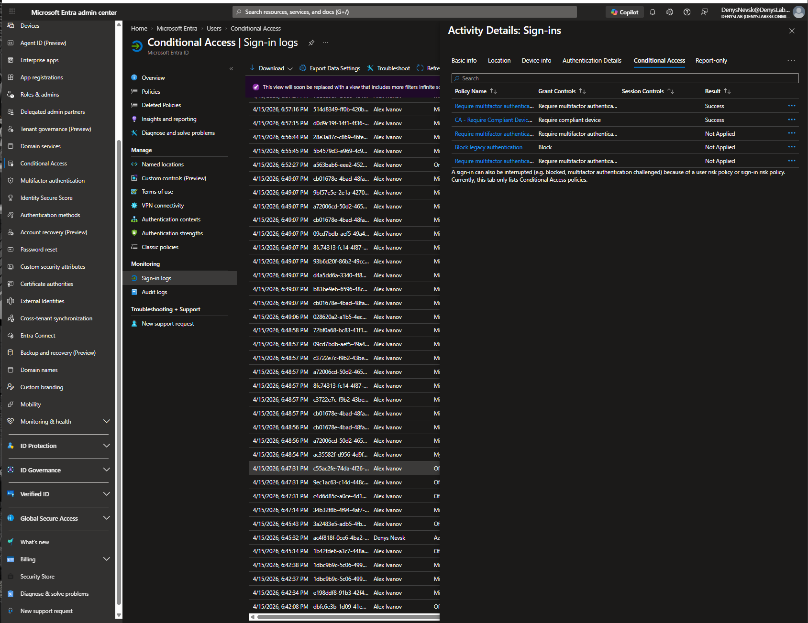

---

### Device Info

Состояние устройства:
- Compliant: Yes
- Managed: Yes
- Join Type: Hybrid Azure AD Joined

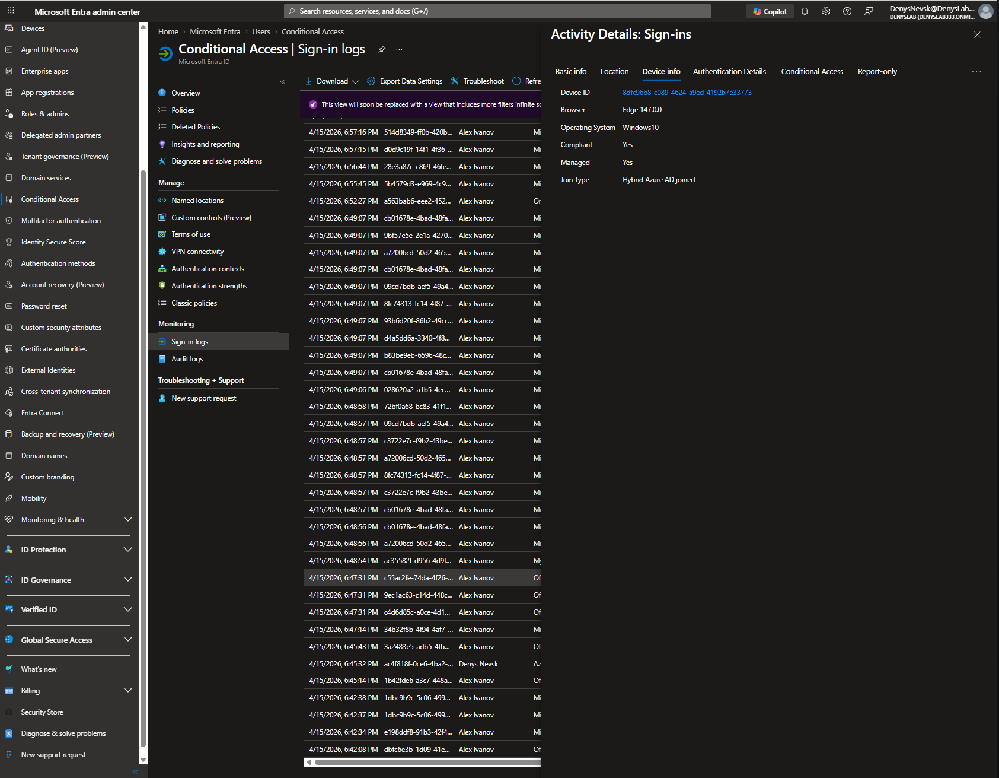

## Step 3 — Scenario 2 (Laptop)

Устройство не состоит в домене, но зарегистрировано в Entra ID через "Access work or school".

### Basic Info

Успешный вход пользователя с использованием MFA.

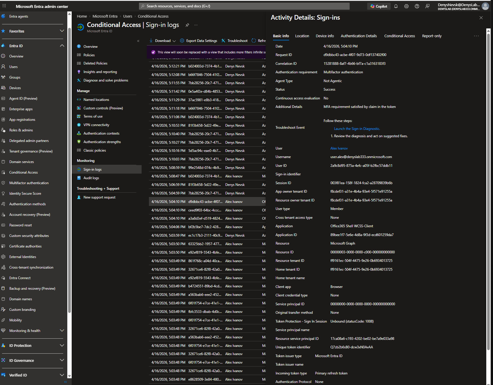

---

### Conditional Access

Политика Conditional Access успешно применена.
Требование compliant устройства выполнено.

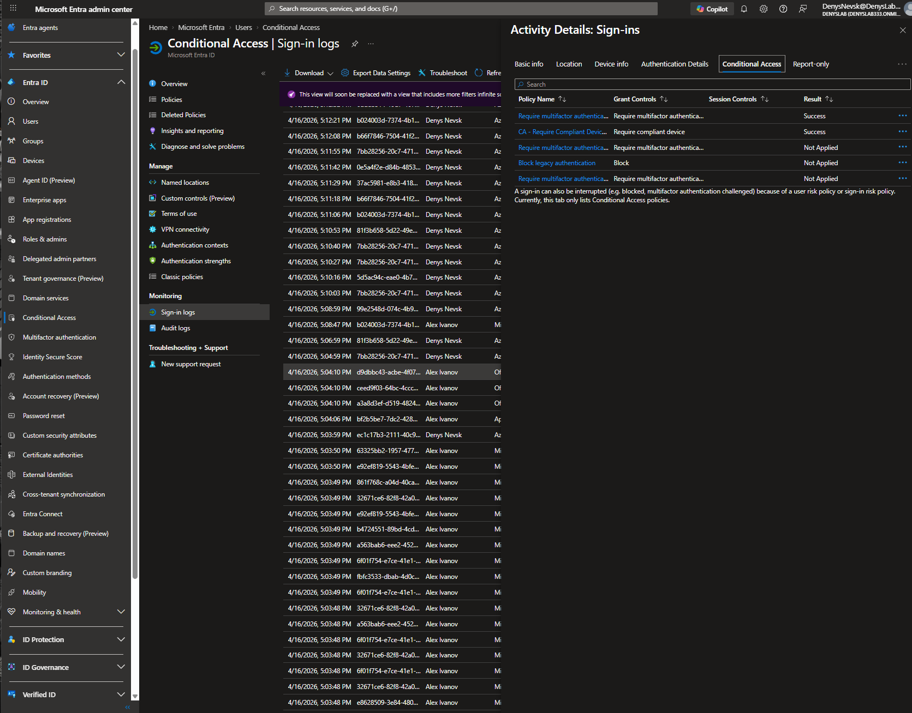

---

### Device Info

Состояние устройства:
- Compliant: Yes
- Managed: Yes
- Join Type: Azure AD Registered

Важно:
Даже устройство, которое не состоит в домене (не joined), может получить доступ,
если оно управляется через Intune и соответствует требованиям.

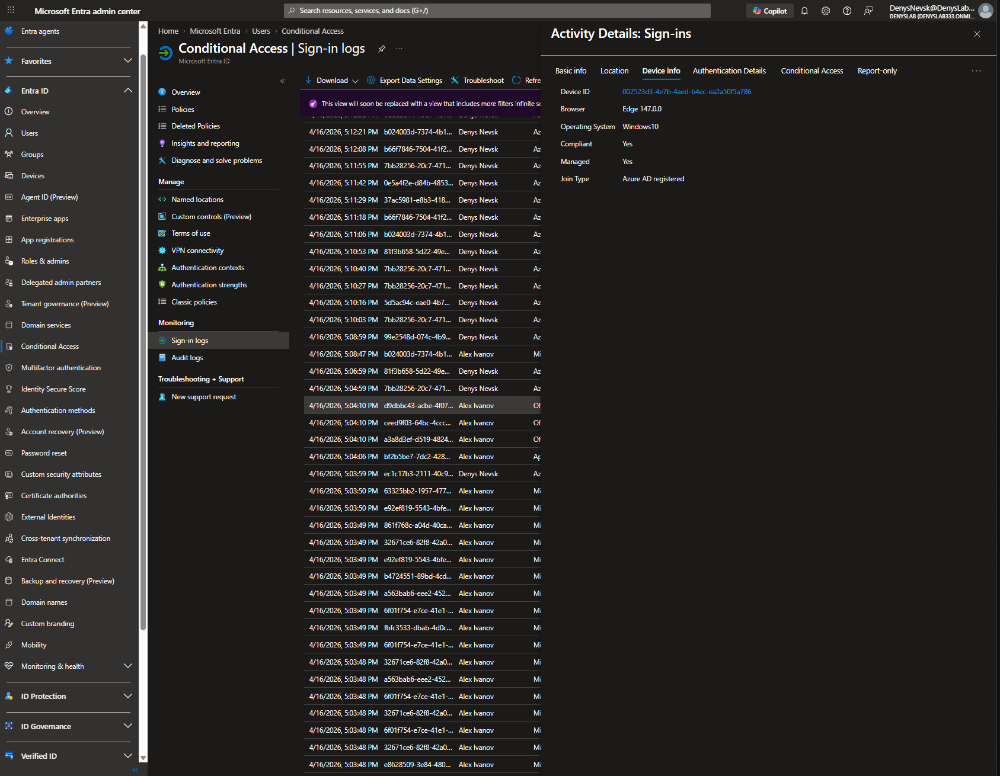

## Step 4 — Scenario 3 (Host — unmanaged device)

Устройство не подключено к домену и не зарегистрировано в Entra ID.

### Basic Info

Попытка входа с использованием MFA, но доступ не предоставлен.

- Status: Failure
- Error code: 53000

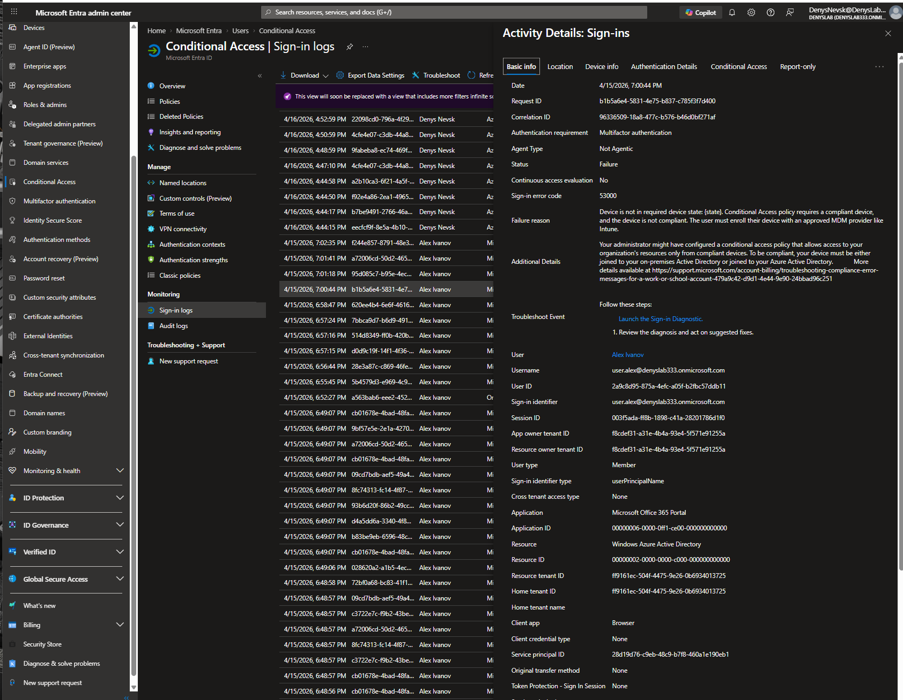

---

### Conditional Access

Политика Conditional Access заблокировала доступ.

Требование compliant устройства НЕ выполнено.

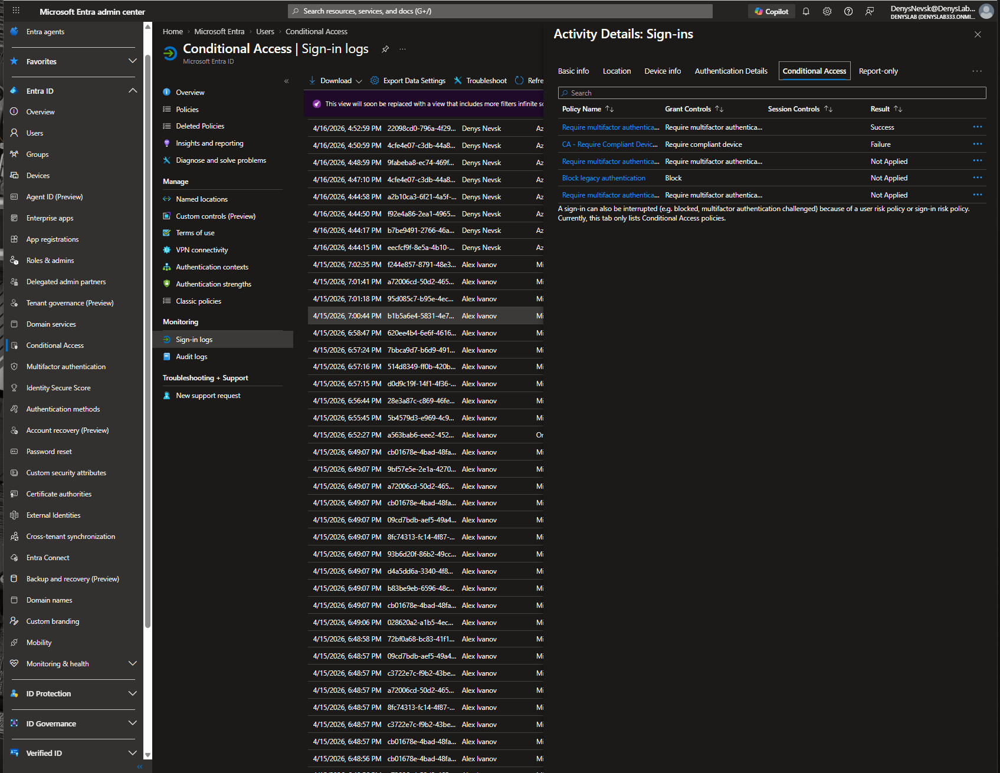

---

### Device Info

Состояние устройства:
- Compliant: No
- Managed: No
- Join Type: отсутствует

Это означает, что устройство не зарегистрировано и не управляется через Intune.

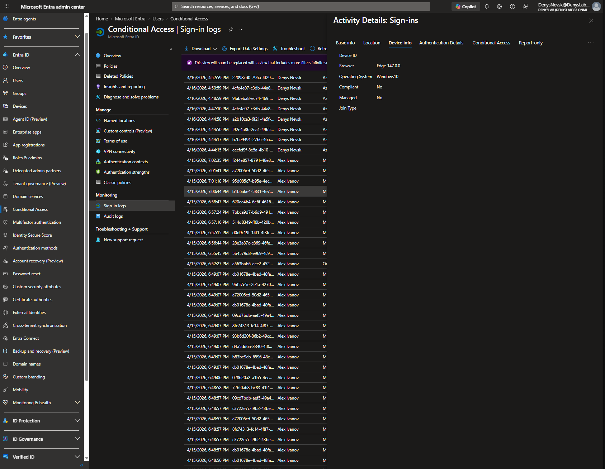

## Step 5 — Analysis

Conditional Access принимает решение о доступе на основе комбинации:
- аутентификации пользователя (identity)
- состояния устройства (device state)

Важно понимать, что успешная аутентификация (MFA) сама по себе НЕ гарантирует доступ.

В данном кейсе ключевым фактором является состояние устройства — compliant или нет.

Анализ сценариев:

1. Domain VM:
- Устройство Hybrid Azure AD Joined
- Управляется через Intune
- Compliant = Yes
→ доступ разрешён

2. Laptop:
- Устройство Azure AD Registered
- Управляется через Intune
- Compliant = Yes
→ доступ разрешён

3. Host:
- Устройство не зарегистрировано
- Не управляется через Intune
- Compliant = No
→ доступ запрещён (ошибка 53000)

Ключевой вывод:

Conditional Access НЕ зависит напрямую от типа подключения устройства (Join / Registration).

Решающим фактором является наличие статуса compliance, который определяется через Microsoft Intune.

Если устройство:
- не зарегистрировано в Intune
- не имеет статуса compliance

оно автоматически считается несоответствующим требованиям и доступ блокируется.

Таким образом, модель принятия решения выглядит следующим образом:

Identity (MFA) + Device State (Compliant) → Access Decision

Если хотя бы одно условие не выполняется — доступ запрещается.

## Step 5 — Analysis

Conditional Access принимает решение о доступе на основе комбинации:
- аутентификации пользователя (identity)
- состояния устройства (device state)

Важно понимать, что успешная аутентификация (MFA) сама по себе НЕ гарантирует доступ.

В данном кейсе ключевым фактором является состояние устройства — compliant или нет.

Анализ сценариев:

1. Domain VM:
- Устройство Hybrid Azure AD Joined
- Управляется через Intune
- Compliant = Yes
→ доступ разрешён

2. Laptop:
- Устройство Azure AD Registered
- Управляется через Intune
- Compliant = Yes
→ доступ разрешён

3. Host:
- Устройство не зарегистрировано
- Не управляется через Intune
- Compliant = No
→ доступ запрещён (ошибка 53000)

Ключевой вывод:

Conditional Access НЕ зависит напрямую от типа подключения устройства (Join / Registration).

Решающим фактором является наличие статуса compliance, который определяется через Microsoft Intune.

Если устройство:
- не зарегистрировано в Intune
- не имеет статуса compliance

оно автоматически считается несоответствующим требованиям и доступ блокируется.

Таким образом, модель принятия решения выглядит следующим образом:

Identity (MFA) + Device State (Compliant) → Access Decision

Если хотя бы одно условие не выполняется — доступ запрещается.

### Подтверждение состояния устройств в Intune

В Intune видно, что только управляемые устройства имеют статус compliant.
Неуправляемое устройство (Host) отсутствует в списке и не имеет статуса соответствия.

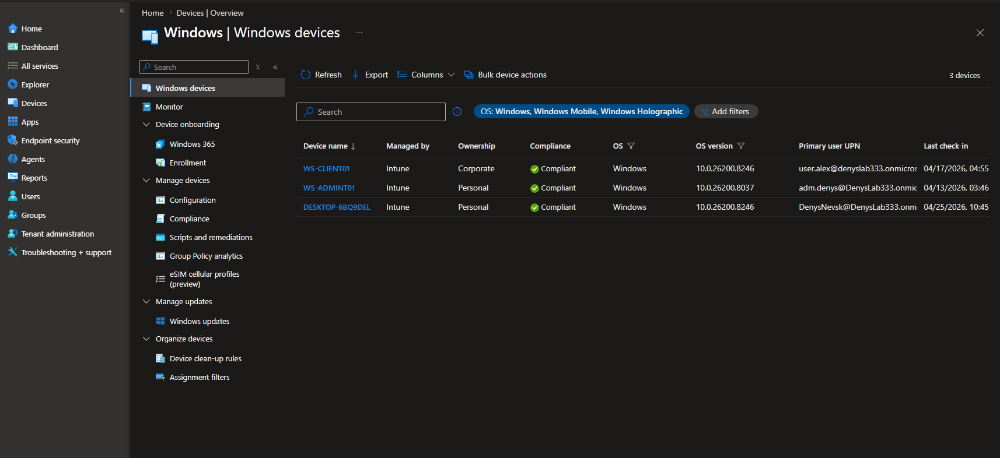

## Step 6 — Key Findings

- Успешная аутентификация (MFA) не гарантирует доступ к ресурсам.
  Conditional Access всегда оценивает дополнительные сигналы, включая состояние устройства.

- Ключевым фактором является статус устройства (compliance), а не тип подключения.
  Устройства могут быть:
  - Hybrid Azure AD Joined
  - Azure AD Registered  
  и при этом получать доступ, если они соответствуют требованиям.

- Microsoft Intune выступает источником истины для состояния устройства.
  Именно Intune определяет, является ли устройство compliant.

- Устройства, не зарегистрированные и не управляемые через Intune,
  не имеют статуса compliance и автоматически считаются несоответствующими требованиям.

- Conditional Access является финальной точкой принятия решения.
  Он объединяет данные об идентификации пользователя и состоянии устройства
  для разрешения или блокировки доступа.

- Модель доступа строится по принципу:
  доступ разрешён только при выполнении всех условий политики.
  Нарушение любого условия (например, отсутствие compliance) приводит к отказу.

- Практический вывод:
  для обеспечения безопасного доступа необходимо не только управлять пользователями,
  но и контролировать состояние устройств через MDM (Intune).