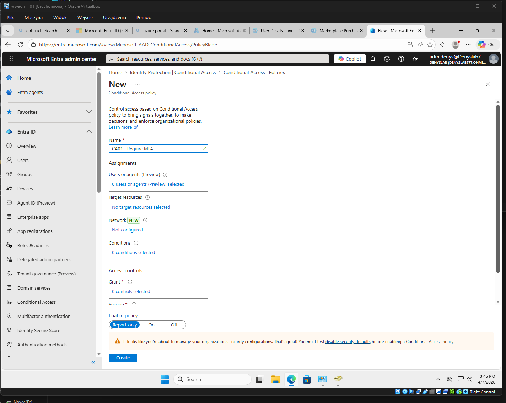
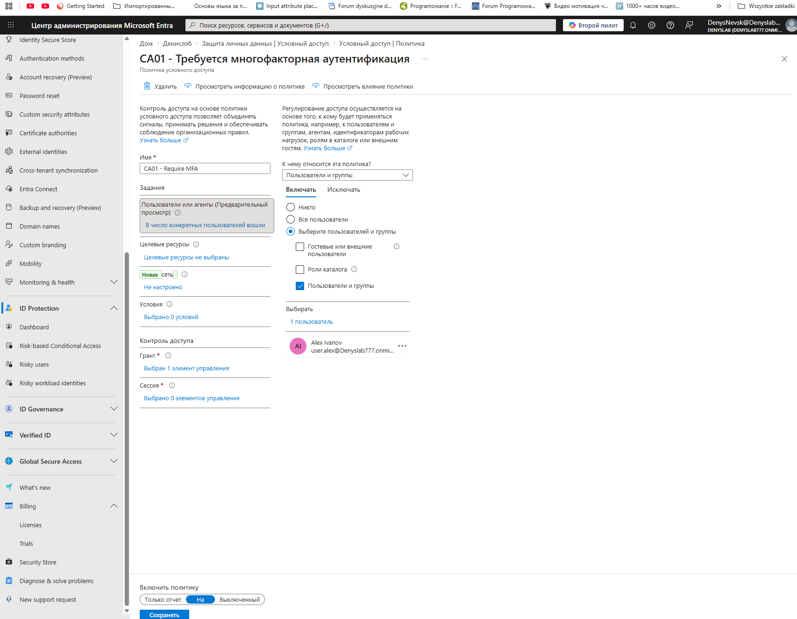
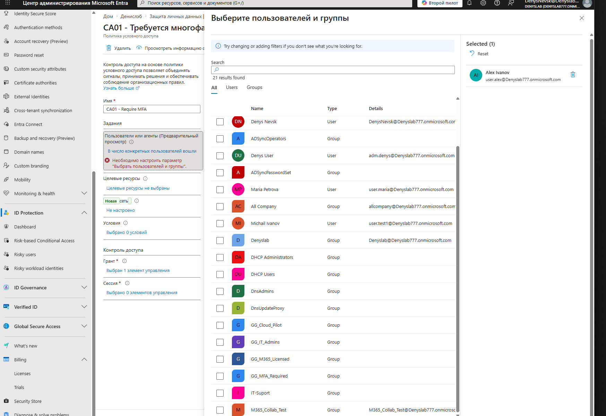
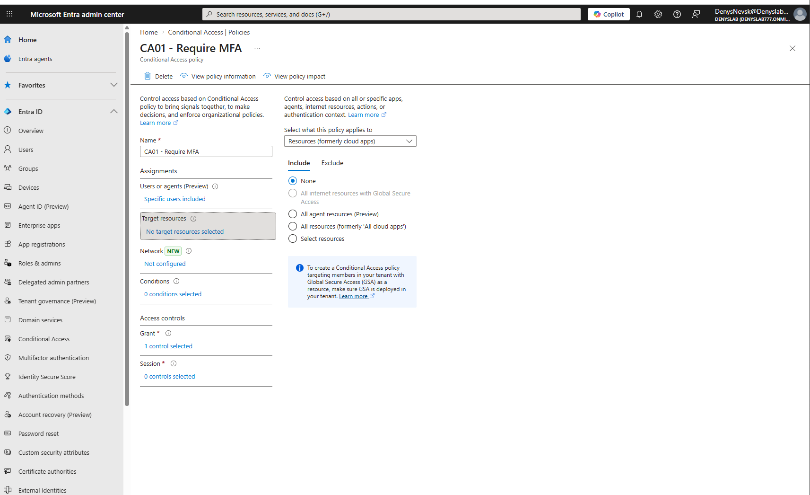
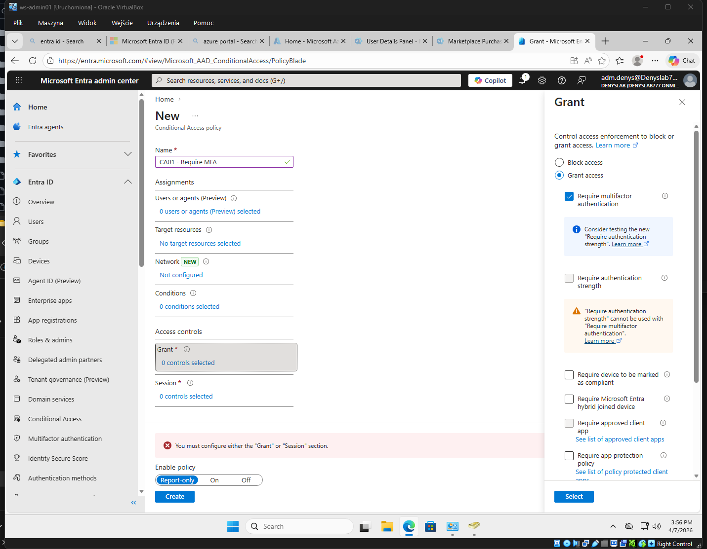
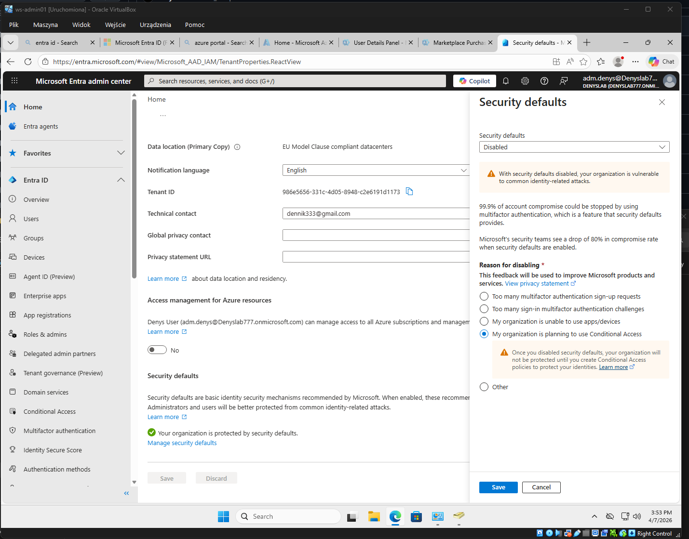
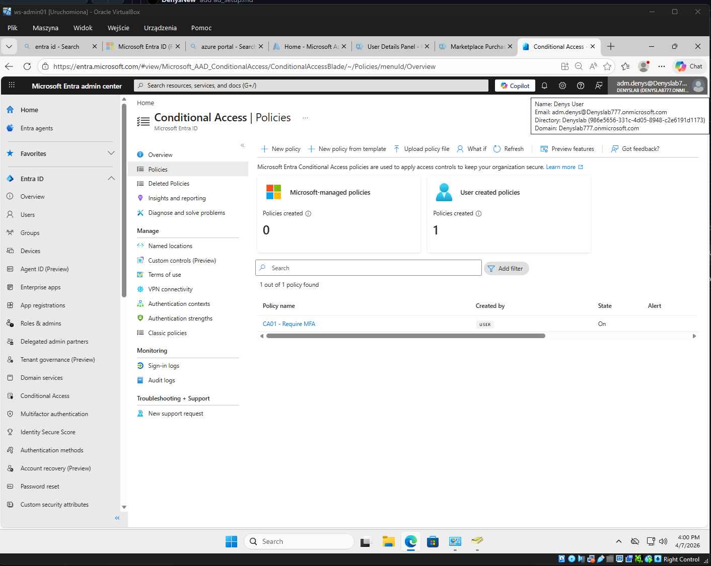
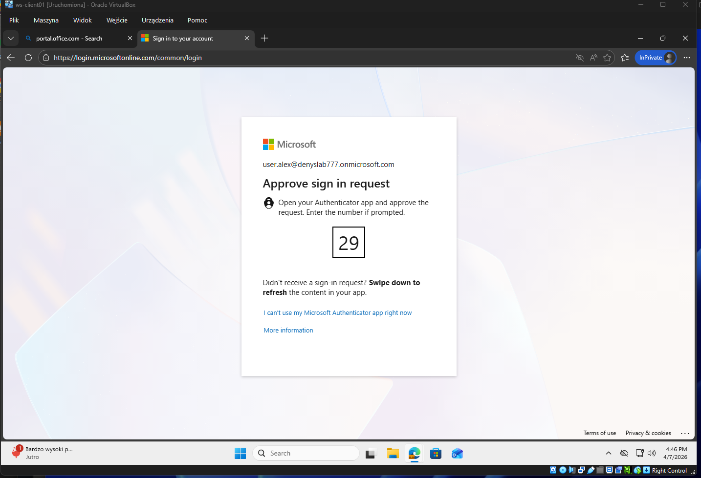

# Conditional Access – Require MFA (Microsoft Entra ID)

## Overview (EN)

This lab demonstrates how to configure a Conditional Access policy in Microsoft Entra ID to enforce Multi-Factor Authentication (MFA) for a specific user. The policy is tested to verify that MFA is triggered during sign-in.

---

## Описание (RU)

В этом сценарии настроена политика Conditional Access в Microsoft Entra ID, которая требует многофакторную аутентификацию (MFA) для конкретного пользователя.

Показан полный процесс:

* создание политики
* назначение пользователя
* настройка MFA
* отключение Security Defaults
* проверка работы MFA при входе

---

## Policy Configuration

### 1. Policy creation

Создана политика Conditional Access:

---

### 2. User assignment

Назначен конкретный пользователь:

Выбор пользователя:

---

### 3. Target resources

Политика применяется к ресурсам:

---

### 4. Grant control (MFA)

Настроено требование MFA:

---

### 5. Disable Security Defaults

Отключены Security Defaults для использования Conditional Access:

---

### 6. Policy enabled

Политика включена:

---

## Testing MFA

При входе пользователя сработала многофакторная аутентификация:

---

## Result

* Conditional Access policy успешно создана и применена
* Пользователь требует MFA при входе
* Настроена интеграция с Microsoft Authenticator
* Подтверждена работа политики через тест входа

---

## Key Concepts

* Conditional Access = IF → THEN
* Identity-based security control
* MFA enforcement
* Security Defaults vs Conditional Access
* Policy assignment (User vs Group)

---

## Conclusion

Данный сценарий демонстрирует базовую настройку Conditional Access и применение MFA в Microsoft 365 / Entra ID.

Это ключевой механизм защиты учетных записей и один из основных инструментов администратора и SOC специалиста.
