# OpenVPN Setup

## Overview (EN)

Install OpenVPN and Easy-RSA on Ubuntu Server, configure certificate-based authentication using PKI, and perform a basic client connection test to verify that the VPN tunnel is established.

## Описание (RU)

Установка OpenVPN и Easy-RSA на Ubuntu Server, настройка аутентификации через сертификаты (PKI) и базовая проверка подключения клиента для подтверждения, что VPN-туннель успешно устанавливается.

---
## 1. Установка OpenVPN и Easy-RSA

Устанавливаем необходимые пакеты на Ubuntu Server:

```bash
sudo apt update
sudo apt install openvpn easy-rsa
```

* OpenVPN — сервис, который поднимает VPN-туннель
* Easy-RSA — инструмент для создания сертификатов (PKI), используемых для аутентификации

OpenVPN и Easy-RSA установлены и готовы к дальнейшей настройке.

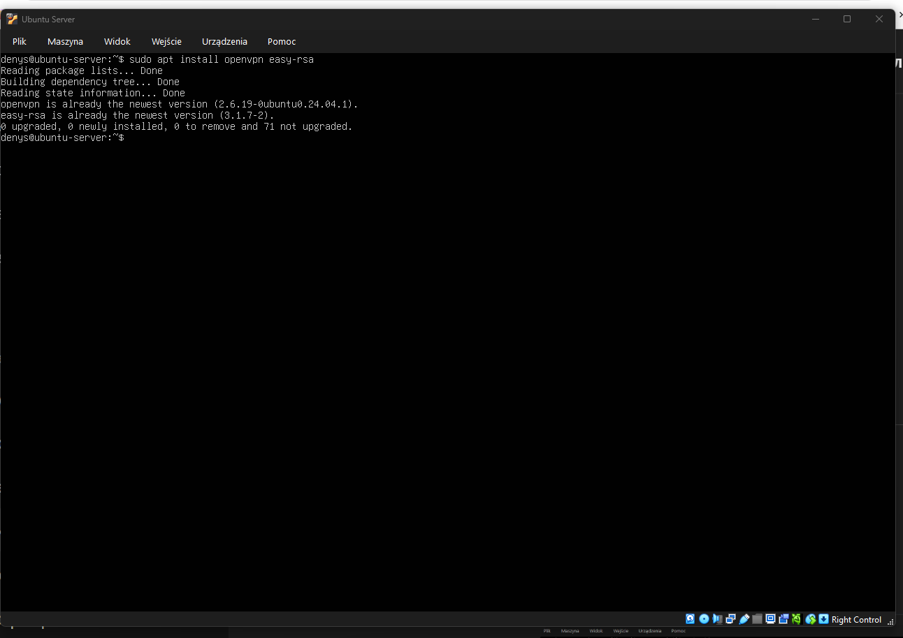

## 2. Подготовка рабочей директории Easy-RSA

Создаём рабочую директорию для Easy-RSA, в которой будет размещена инфраструктура PKI:

```bash
make-cadir /home/denys/easy-rsa
cd /home/denys/easy-rsa
ls
```

**Пояснение:**

* `make-cadir` создаёт рабочую директорию Easy-RSA
* в неё копируются необходимые скрипты и шаблоны
* эта директория будет использоваться для генерации сертификатов

**Результат:**
Создана рабочая директория Easy-RSA с необходимыми файлами (`easyrsa`, `vars`, конфигурации OpenSSL).

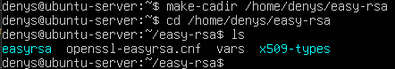

---
## 3. Инициализация PKI

Инициализируем инфраструктуру открытых ключей (PKI):

```bash 
cd /home/denys/easy-rsa
./easyrsa init-pki
```

**Пояснение:**

* команда `init-pki` создаёт структуру PKI
* формируется директория `pki/`, в которой будут храниться ключи и сертификаты

**Результат:**
Создана директория PKI (`/home/denys/easy-rsa/pki`), готовая к созданию центра сертификации (CA).

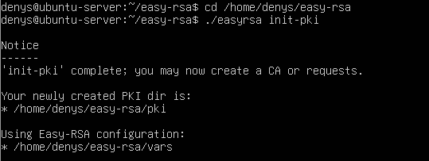

---
## 4. Создание центра сертификации (CA)

Создаём центр сертификации (Certificate Authority):

```bash 
./easyrsa build-ca
```

**Пояснение:**

* создаётся корневой сертификат (CA)
* он используется для подписи всех остальных сертификатов (сервер и клиенты)
* задаётся пароль и имя центра сертификации

**Результат:**
Создан центр сертификации и файл сертификата `ca.crt`, который будет использоваться для проверки подлинности.

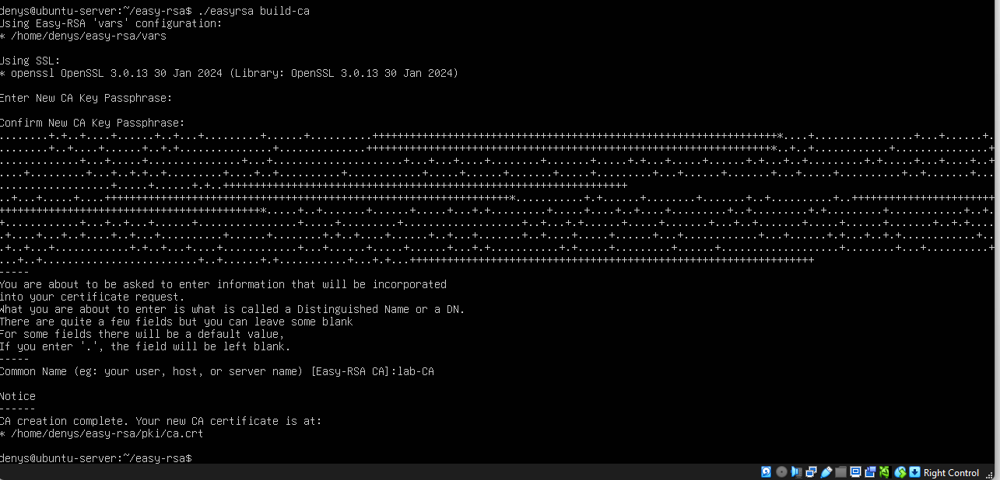

---
## 5. Создание запроса на сертификат сервера

Генерируем приватный ключ сервера и запрос на сертификат:

```bash
./easyrsa gen-req server nopass
```

**Пояснение:**

* создаётся приватный ключ сервера (`server.key`)
* создаётся запрос на сертификат (`server.req`)
* параметр `nopass` означает, что ключ создаётся без пароля

**Результат:**
Сгенерированы файлы:

* `pki/private/server.key`
* `pki/reqs/server.req`

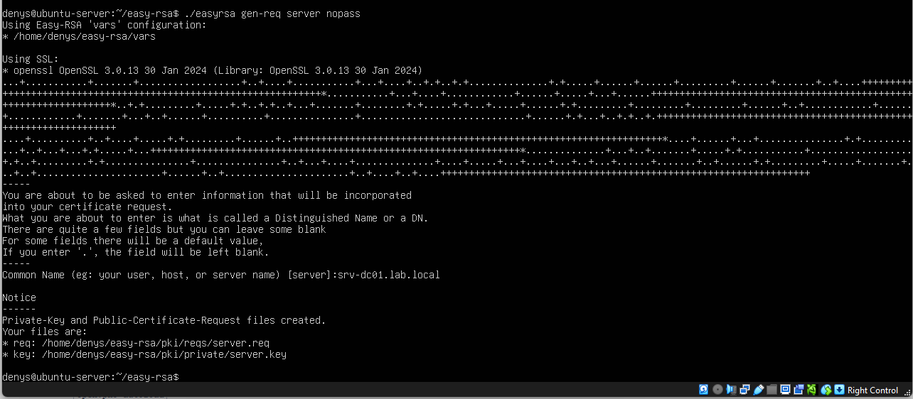

---
## 6. Подписание сертификата сервера

Подписываем запрос на сертификат сервера с помощью центра сертификации (CA):

```bash
./easyrsa sign-req server server
```

**Пояснение:**

* запрос `server.req` подписывается CA
* подтверждается подлинность сертификата
* вводится пароль CA и подтверждение операции

**Результат:**
Создан сертификат сервера:

* `pki/issued/server.crt`

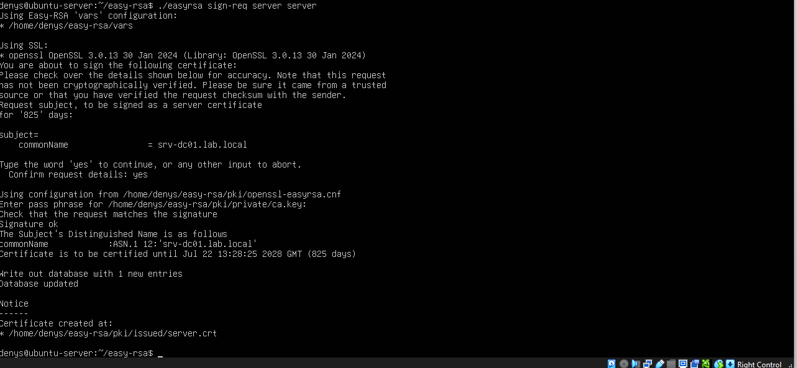

---

## 7. Генерация DH параметров

Генерируем параметры Диффи-Хеллмана:

```bash
./easyrsa gen-dh
```

**Пояснение:**

* создаются параметры для обмена ключами
* используются при установлении защищённого соединения

**Результат:**
Создан файл:

* `pki/dh.pem`

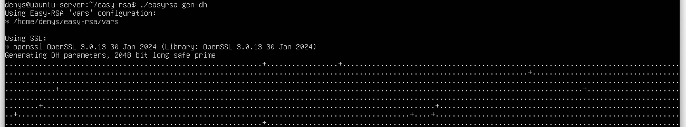
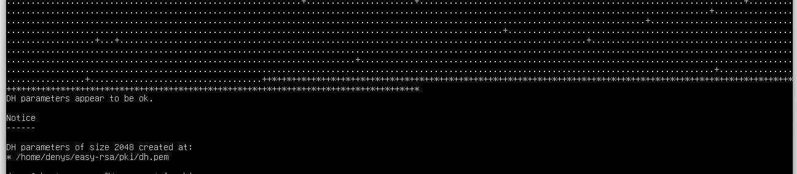

---
## 8. Генерация TLS ключа

Генерируем дополнительный ключ защиты канала:

```bash
openvpn --genkey secret ta.key
```

**Пояснение:**

* создаётся дополнительный ключ (`ta.key`)
* используется для защиты TLS-соединения (tls-auth / tls-crypt)
* защищает VPN от атак (например, DoS и сканирования)

**Результат:**
Создан файл:

* `ta.key`

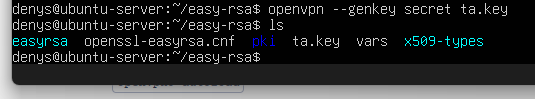

---
## 9. Настройка конфигурации OpenVPN сервера

Создаём конфигурационный файл:

```bash
sudo nano /etc/openvpn/server.conf
```

Конфигурация:

```bash
port 1194
proto udp
dev tun

ca /etc/openvpn/ca.crt
cert /etc/openvpn/server.crt
key /etc/openvpn/server.key
dh /etc/openvpn/dh.pem
tls-auth /etc/openvpn/ta.key 0

server 10.8.0.0 255.255.255.0
push "route 10.10.10.0 255.255.255.0"

keepalive 10 120

data-ciphers AES-256-GCM:AES-128-GCM
auth SHA256

user nobody
group nogroup

persist-key
persist-tun

status openvpn-status.log
verb 3
```

**Пояснение:**

* `server 10.8.0.0` — VPN сеть
* `push route` — доступ к внутренней сети LAB
* `ca / cert / key` — сертификаты
* `dh` — параметры обмена ключами
* `tls-auth` — защита TLS

**Результат:**
OpenVPN сервер настроен и готов к запуску.

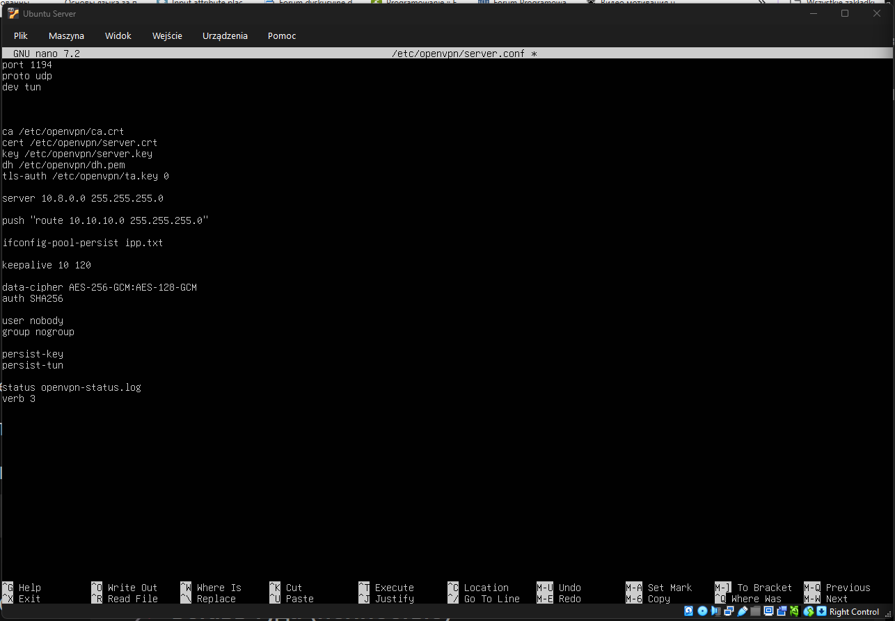

---
## 10. Проверка статуса OpenVPN сервера

Перезапускаем сервис OpenVPN и проверяем его статус:

```bash
sudo systemctl restart openvpn@server
sudo systemctl status openvpn@server --no-pager -l
```

**Результат:**

* сервис успешно запущен
* статус: `active (running)`
* в логах присутствует строка `Initialization Sequence Completed`

Это означает, что OpenVPN сервер работает и готов принимать подключения.

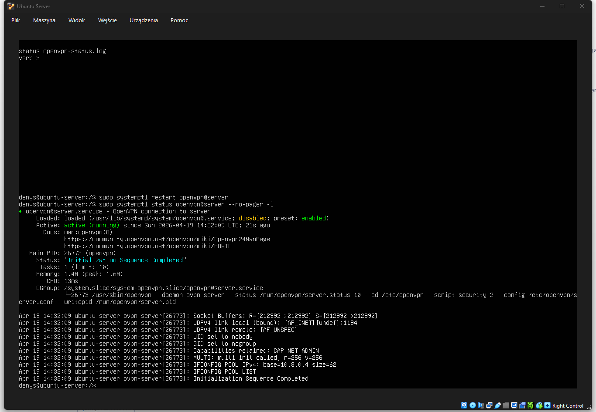

---
## Итог

На этом этапе выполнена установка и базовая настройка OpenVPN сервера на Ubuntu:

* установлен OpenVPN
* подготовлена PKI через Easy-RSA
* создан центр сертификации (CA)
* сгенерированы серверные ключи и сертификаты
* создан TLS ключ
* настроен файл `server.conf`
* сервис OpenVPN успешно запущен

Следующие этапы вынесены в отдельные файлы:

* настройка клиента OpenVPN: [Client setup.md](../20-openvpn-client/client-setup.md)
* настройка сетевого доступа (IP forwarding, NAT, маршрутизация): [Client setup.md](../20-openvpn-client/client-setup.md)
---
