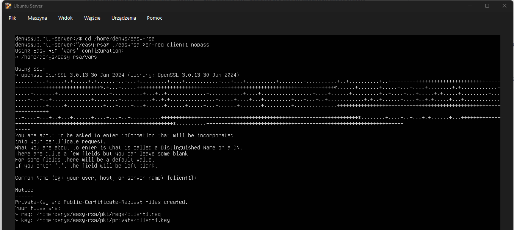
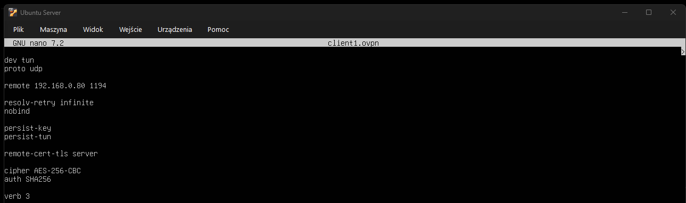
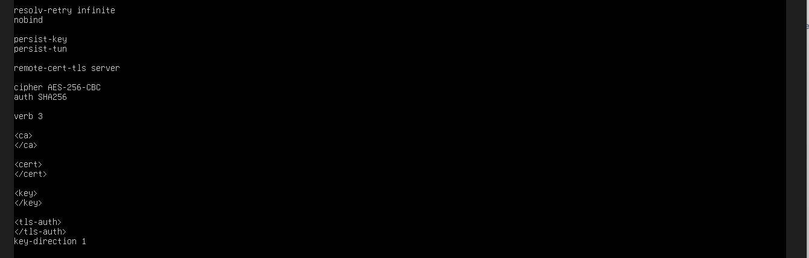
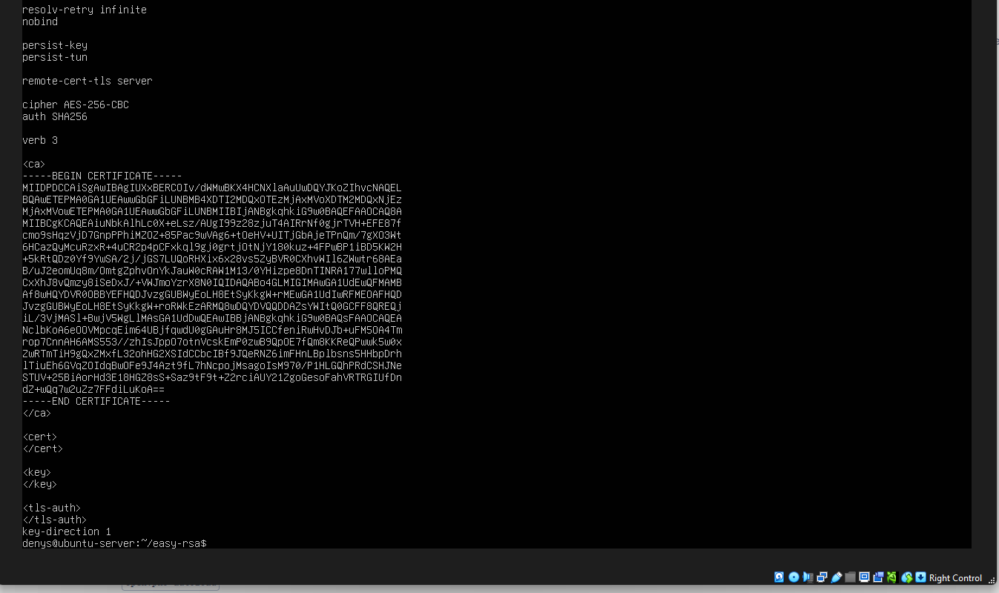
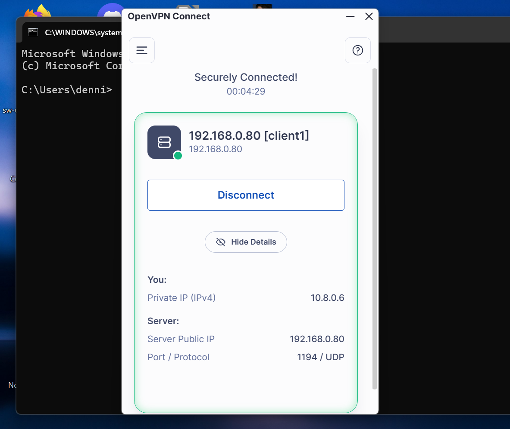

## OpenVPN Client Setup

### Overview (EN)

This section covers the creation of a single OpenVPN client configuration using Easy-RSA certificates. The client setup is used to verify tunnel establishment and remote connectivity to the internal LAB network (10.10.10.0/24) through NAT and port forwarding. This is a basic certificate-based configuration, which will be extended later with centralized authentication using RADIUS.

### Описание (RU)

В данном разделе настраивается один клиент OpenVPN с использованием сертификатов Easy-RSA. Конфигурация используется для проверки установления туннеля и удалённого доступа к внутренней LAB сети (10.10.10.0/24) через NAT и проброс портов. Это базовая схема с сертификатами, которая в дальнейшем будет расширена с использованием централизованной аутентификации через RADIUS.

## 1. Генерация client key и CSR

Генерируем приватный ключ клиента и запрос на подпись сертификата (CSR) с помощью Easy-RSA:

```bash
./easyrsa gen-req client1 nopass
```

**Пояснение:**

* команда gen-req создаёт приватный ключ клиента и запрос на подпись сертификата
* client1 — имя клиента
* параметр nopass отключает пароль на приватный ключ
* этот запрос позже подписывается через CA

**Результат:**
Созданы файлы client1.key и client1.req для клиента OpenVPN.



---
## 2. Подпись сертификата клиента через CA

Подписываем запрос на сертификат клиента с использованием центра сертификации (CA), созданного ранее:

```bash
./easyrsa sign-req client client1
```

**Пояснение:**

* команда sign-req подписывает клиентский запрос на сертификат
* параметр client указывает тип сертификата
* client1 — имя клиента, для которого выполняется подпись
* в процессе подтверждается запрос и вводится пароль CA-ключа

**Результат:**
Создан подписанный сертификат клиента client1.crt, который будет использоваться для подключения к OpenVPN серверу.


---
## 3. Создание конфигурационного файла клиента (.ovpn)

Создаём конфигурационный файл клиента OpenVPN, который будет использоваться для подключения к серверу.

```bash
nano client1.ovpn
```

**Пояснение:**

* создаётся файл конфигурации клиента
* параметр client указывает режим клиента
* dev tun — используется туннельный интерфейс
* proto udp — протокол подключения
* remote 192.168.0.80 1194 — адрес и порт VPN сервера, доступный клиенту
* остальные параметры отвечают за стабильность соединения и безопасность

**Результат:**
Создан файл client1.ovpn с базовой конфигурацией для подключения к OpenVPN серверу.



---
## 4. Подготовка структуры .ovpn файла

В конфигурационный файл клиента добавлены блоки для сертификатов и ключей.

```bash
nano client1.ovpn
```

**Пояснение:**

* в файл добавлены секции <ca>, <cert>, <key>, <tls-auth>
* эти секции используются для последующей вставки сертификатов и ключей в inline-формате
* на данном этапе подготовлена структура конфигурационного файла клиента

**Результат:**
Файл client1.ovpn содержит подготовленные блоки для последующей вставки сертификатов и ключей.



---
## 5. Добавление сертификатов в .ovpn файл

В конфигурационный файл клиента добавлены сертификаты и ключи в inline-формате.

Команда:
nano client1.ovpn

**Пояснение:**

* сертификаты CA, клиента и ключ вставлены непосредственно в .ovpn файл
* используются блоки <ca>, <cert>, <key>, <tls-auth>
* файл становится самодостаточным и не требует отдельных сертификатов

**Результат:**
Файл client1.ovpn полностью настроен и готов к использованию для подключения к OpenVPN серверу.



---
## 6. Проверка подключения клиента

Файл client1.ovpn был импортирован в OpenVPN Connect и использован для подключения к OpenVPN серверу.

**Пояснение:**

* клиентский профиль client1 отображается в OpenVPN Connect
* подключение выполнено по UDP на порт 1194
* клиент получил VPN IP-адрес из сети 10.8.0.0/24
* статус Securely Connected подтверждает успешное установление VPN-туннеля

**Результат:**
Клиент успешно подключился к OpenVPN серверу. Проверка маршрутизации и доступа к LAB сети будет описана отдельно в разделе Network Access.



---
## Итог

OpenVPN сервер был настроен на Ubuntu сервере и успешно принимает подключения от внешнего клиента.

В рамках данного файла выполнена проверка:

* корректности клиентского конфигурационного файла
* успешного установления VPN-туннеля
* получения клиентом IP-адреса из VPN сети (10.8.0.0/24)

Данный этап подтверждает, что VPN-сервер работает корректно на уровне подключения.

**Важно:**
Доступ к внутренней LAB сети (10.10.10.0/24), маршрутизация и настройка сетевого взаимодействия рассматриваются отдельно в файле:

network-access.md

**Дальнейшие шаги:**

Следующим этапом будет настройка централизованной аутентификации через FreeRADIUS для интеграции OpenVPN с системой авторизации.

---
