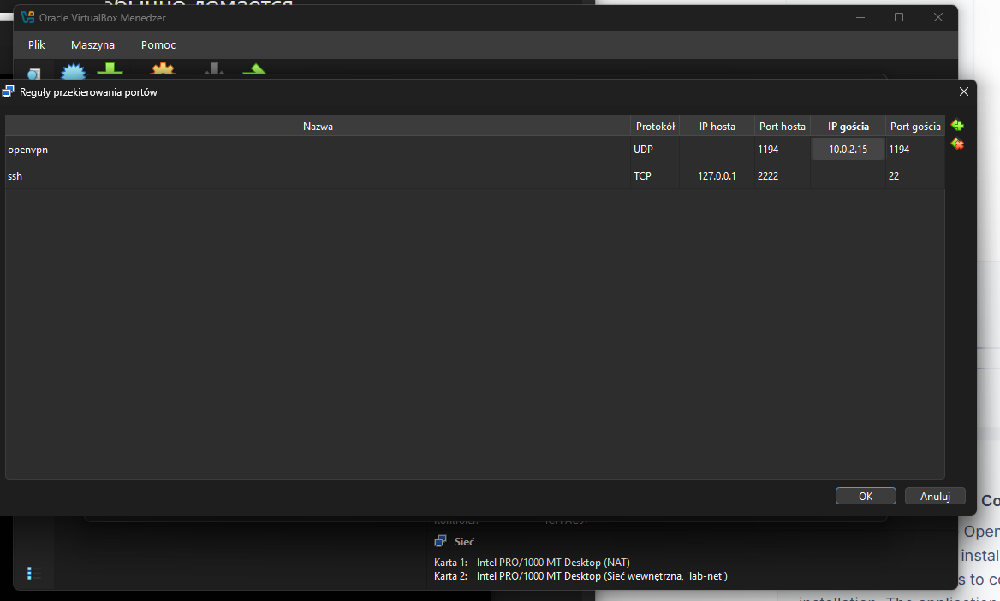
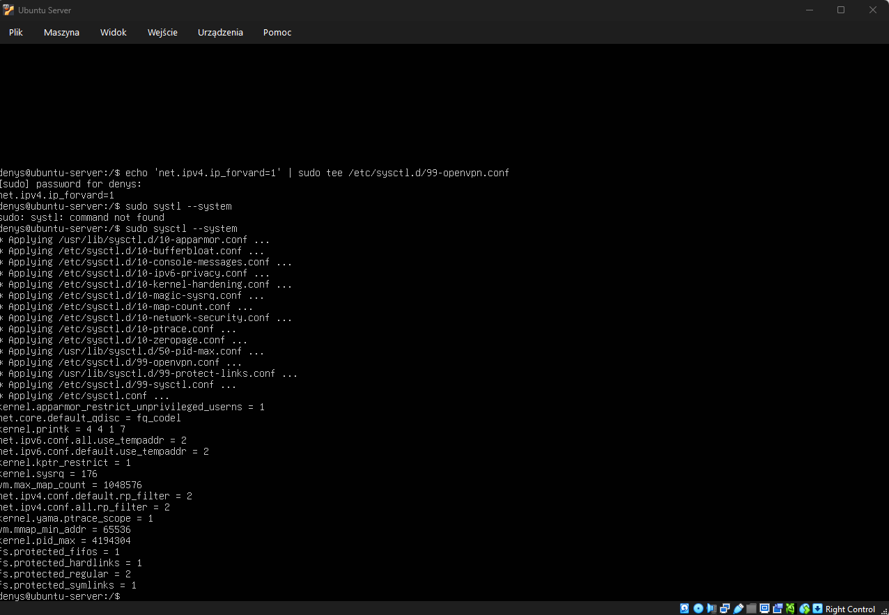
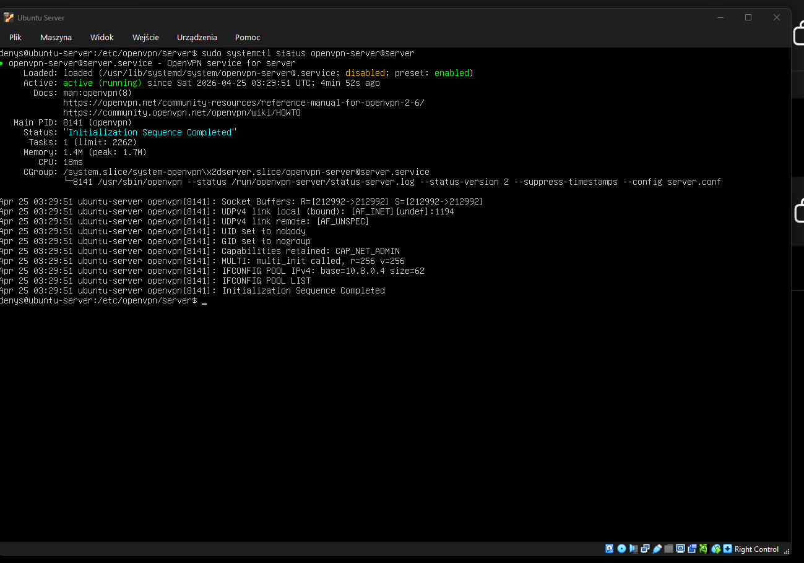
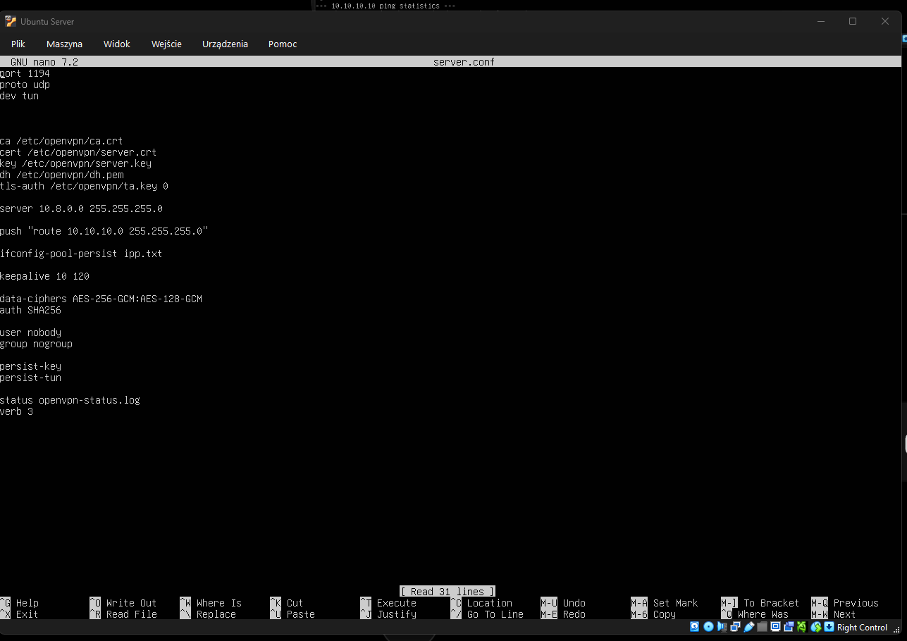
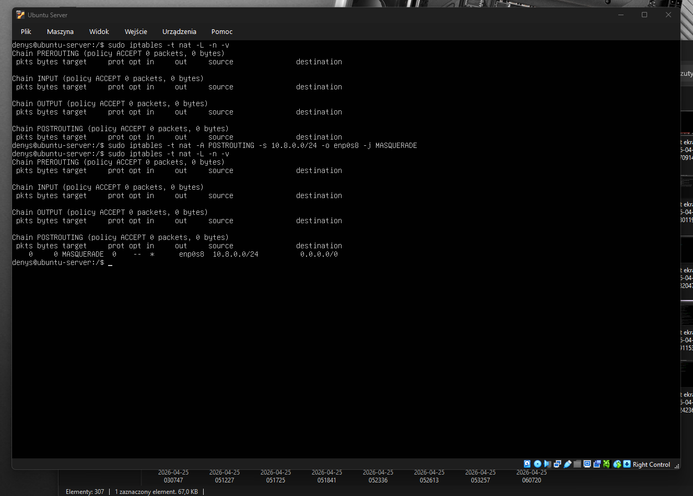
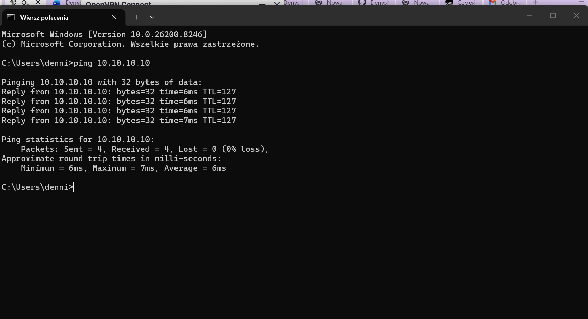

# VPN Network Access (Routing & NAT)

## Overview (EN)
Configure routing and NAT on an OpenVPN server running on a virtual machine (VirtualBox host) to allow external clients (laptop) to access the internal LAB network (10.10.10.0/24) via VPN (10.8.0.0/24).

## Описание (RU)
Настроить маршрутизацию и NAT на OpenVPN-сервере, работающем на виртуальной машине (VirtualBox host), чтобы внешний клиент (ноутбук) мог получать доступ к внутренней лабораторной сети (10.10.10.0/24) через VPN (10.8.0.0/24).

## Схема сети

+-------------------+
|   Laptop (Client) |
+-------------------+
          |
          | UDP 1194
          v
+------------------------+
| Host (Windows / NAT)   |
+------------------------+
          |
          | Port Forwarding
          v
+---------------------------+
| Ubuntu Server (OpenVPN)   |
+---------------------------+
          |
          | Internal Network (lab-net)
          v
+-------------------------------+
| LAB Network (10.10.10.0/24)   |
+-------------------------------+
**Пояснение:**

* клиент подключается к VPN серверу через хост-машину
* VirtualBox использует NAT, поэтому требуется port forwarding
* VPN сервер обеспечивает доступ к внутренней LAB сети

---

## 1. Обеспечение доступа к VPN серверу (Port Forwarding)

VPN сервер размещён внутри виртуальной машины (Ubuntu) и использует NAT-сетевой адаптер.

Для возможности входящих подключений извне настроен проброс портов (Port Forwarding) в VirtualBox.

Команда / настройка:

Host Port: 1194  
Guest IP: 10.0.2.15  
Guest Port: 1194  
Protocol: UDP  

**Пояснение:**

* при использовании NAT виртуальная машина не принимает входящие подключения напрямую
* механизм port forwarding позволяет перенаправлять трафик с хоста на виртуальную машину
* это необходимо для доступа клиентов к VPN серверу

**Результат:**
Входящие подключения к VPN серверу доступны через внешний интерфейс хоста.



---
## 2. Включение IP forwarding

Команды:
```bash
echo net.ipv4.ip_forward=1 | sudo tee /etc/sysctl.d/99-openvpn.conf
sudo sysctl --system
```
Пояснение:

* включает пересылку пакетов между сетевыми интерфейсами  
* необходимо для маршрутизации трафика между VPN сетью и внутренней LAB сети  

Результат:

Сервер способен пересылать трафик между VPN и внутренней сетью.



---
## 3. Запуск OpenVPN сервера

Команды:
```bash
sudo systemctl start openvpn-server@server
sudo systemctl enable openvpn-server@server
sudo systemctl status openvpn-server@server
```
Пояснение:

* используется systemd unit openvpn-server@server  
* конфигурация берётся из /etc/openvpn/server/server.conf  
* enable включает автозапуск сервиса при старте системы  
* status позволяет проверить текущее состояние сервиса  

Результат:

OpenVPN сервер успешно запущен и работает через systemd.



---
## 4. Настройка маршрутизации (OpenVPN)

Действие:

Открыть конфигурационный файл сервера:
```bash
sudo nano /etc/openvpn/server/server.conf
```
Добавить строку:

push "route 10.10.10.0 255.255.255.0"

Пояснение:

* сервер сообщает клиенту, куда отправлять трафик для внутренней LAB сети  
* без этого клиент не знает, что 10.10.10.0/24 доступна через VPN  

Результат:

Клиент получает маршрут к внутренней сети LAB через VPN.



---
## 5. Настройка NAT (iptables)

**Команда:**
```bash
sudo iptables -t nat -A POSTROUTING -s 10.8.0.0/24 -o enp0s8 -j MASQUERADE
```

**Пояснение:**

- выполняется трансляция адресов (NAT) для VPN сети (10.8.0.0/24)
- трафик направляется в LAB сеть через интерфейс enp0s8
- это необходимо для доступа клиентов VPN к внутренней сети (10.10.10.0/24)

**Результат:**

Правило NAT успешно добавлено в таблицу iptables.



---
## 6. Проверка доступа к LAB сети

**Проверка:**

После настройки маршрутизации и NAT выполняется проверка доступа к внутренней LAB сети через VPN.

На клиентском устройстве выполняется:

ping 10.10.10.10

**Ожидаемый результат:**

- ответы от сервера LAB сети
- отсутствие потерь пакетов

**Результат:**

VPN-клиент успешно подключён и имеет доступ к внутренней сети (10.10.10.0/24).



---
## Итог

Настроен доступ к внутренней LAB сети (10.10.10.0/24) через VPN.

Реализовано:

- проброс порта OpenVPN (UDP 1194) через VirtualBox NAT
- включена маршрутизация (IP forwarding)
- настроен OpenVPN сервер
- добавлен маршрут к LAB сети
- настроен NAT (iptables) для VPN клиентов

Результат:

VPN-клиент успешно подключается и имеет доступ к ресурсам внутренней сети.

Подключение проверено с помощью ping до сервера LAB сети (10.10.10.10).